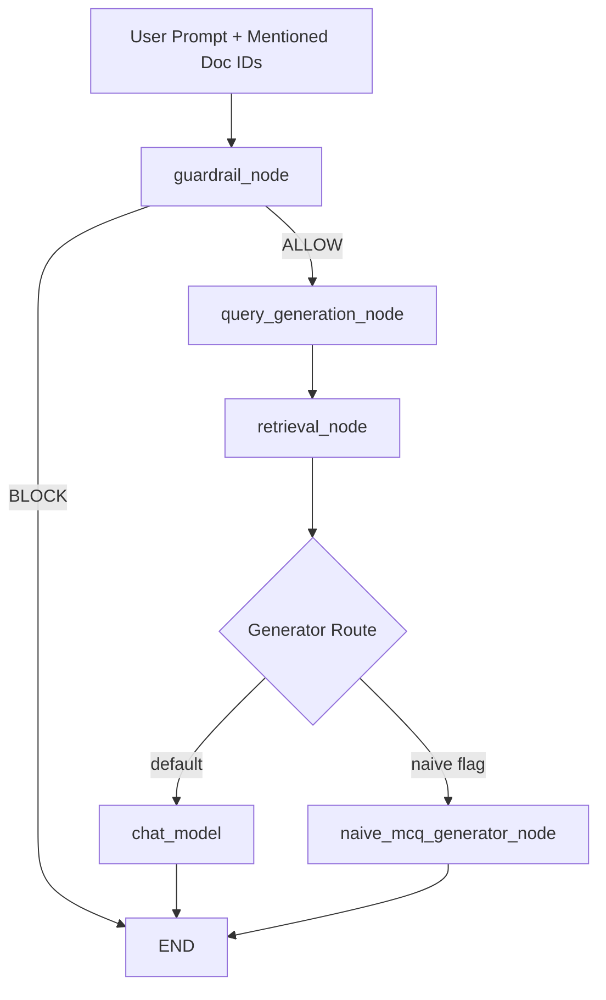

# Otis Agent Flows

## Chat Invoke Flow



## Generation SSE Flow

```mermaid
flowchart TD
  A[/v1/graph/start] --> B[fetch_documents]
  B --> C[generate_summaries]
  C --> D[human_approval interrupt]
  D --> E[/v1/graph/resume]
  E --> F[generate_search_queries]
  F --> G[retrieve_context]
  G --> H[END]
```

## Notes

- Chat retrieval is executed inside LangGraph deterministic nodes.
- Guardrail and intent routing are unchanged.
- Mentioned document IDs are passed from frontend invoke state to backend graph state.
