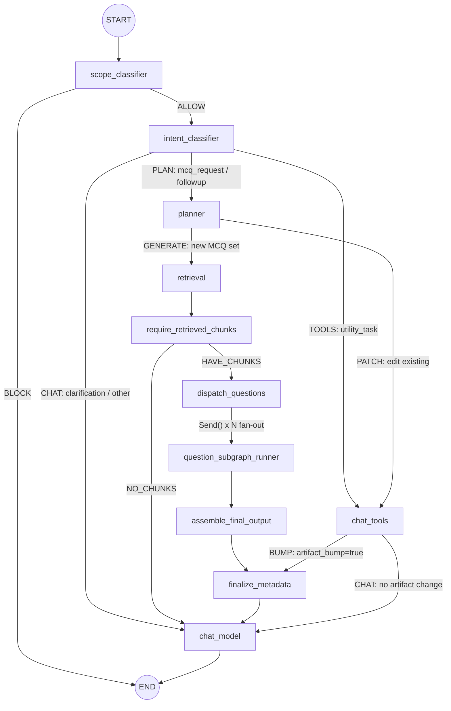
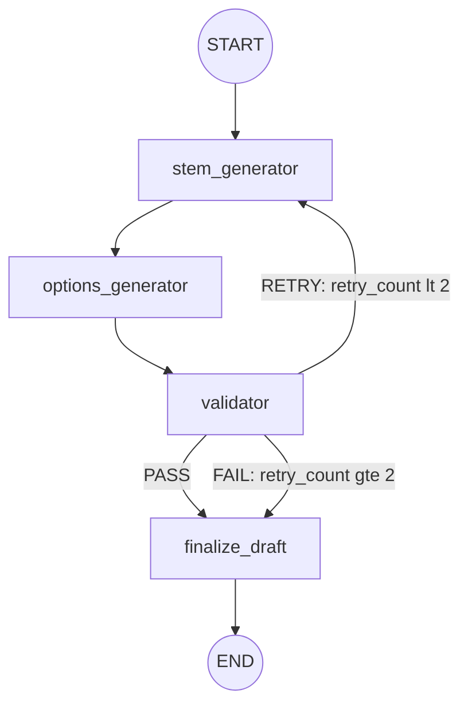

# Otis

An AI-powered educational platform that turns static documents into interactive assessments and conversational tutoring experiences.

Upload a PDF → the system extracts text, generates vector embeddings, and identifies key concepts. A multi-node LangGraph agent then generates validated multiple-choice questions on demand, and serves as a document-grounded conversational tutor.

---

## Table of Contents

- [Project Overview](#project-overview)
- [Tech Stack](#tech-stack)
- [Prerequisites](#prerequisites)
- [Getting Started](#getting-started)
- [Environment Variables](#environment-variables)
- [LangGraph Agent Architecture](#langgraph-agent-architecture)
- [Documentation](#documentation)

---

## Project Overview

Otis is built around two core workflows:

**MCQ Generation** — An educator uploads a PDF. The system parses it (Docling), chunks and embeds the content (Ollama + pgvector), and extracts key concepts. When assessments are requested, a LangGraph agent plans the question set, retrieves relevant chunks via concept-aware two-layer RAG, then fans out parallel subgraph invocations that each generate a question stem, distractors, and explanations — validated in a retry loop.

**Conversational Tutoring** — The same agent handles free-form chat. User messages pass through scope and intent classifiers before routing to document-grounded responses, tool use, or MCQ generation as needed.

---

## Tech Stack

| Layer               | Technology                              |
| ------------------- | --------------------------------------- |
| API                 | FastAPI, SSE streaming                  |
| Agent orchestration | LangGraph (stateful multi-node graphs)  |
| LLM                 | OpenAI (gpt-4o-mini, gpt-4.1-nano)      |
| Embeddings          | Ollama (nomic-embed-text, 768-dim)      |
| Document parsing    | Docling, PyMuPDF                        |
| Vector store        | Postgres 17 + pgvector                  |
| ORM                 | SQLAlchemy 2.0 (async) + asyncpg        |
| Background jobs     | Redis 7 + RQ                            |
| Auth                | JWT (python-jose + bcrypt)              |
| Frontend            | React 19, TypeScript, Vite              |
| UI                  | Tailwind CSS, shadcn/ui, TanStack Query |

LLM inference uses OpenAI for access to high-quality models. Embeddings run locally via Ollama to avoid per-token costs on high-volume, latency-tolerant operations.

---

## Prerequisites

- [Docker](https://docs.docker.com/get-docker/) >= 24 and Docker Compose v2
- An OpenAI API key with access to `gpt-4o-mini` and `gpt-4.1-nano` models

---

## Getting Started

```bash
# Clone and enter the repo
git clone <repo-url> otis && cd otis

# Create env files from the provided templates
cp .env.example .env
cp .env.fastapi.example .env.fastapi
# Edit both files — fill in OpenAI API key, Postgres creds, JWT secret, DB_URL

# Start everything (backend, frontend, database, redis, ollama)
docker compose up --build -d
```

Once running:

| Service            | URL                        |
| ------------------ | -------------------------- |
| Frontend           | http://localhost:5173      |
| API (Swagger docs) | http://localhost:8000/docs |
| pgAdmin            | http://localhost:5050      |

---

## Environment Variables

Otis uses two env files: `.env` for infrastructure/shared secrets and `.env.fastapi` for application settings. See the example files for all available options.

### `.env`

| Variable                   | Required | Description                 |
| -------------------------- | -------- | --------------------------- |
| `OPENAI_API_KEY`           | Yes      | OpenAI API key              |
| `POSTGRES_USER`            | Yes      | Postgres superuser name     |
| `POSTGRES_PASSWORD`        | Yes      | Postgres superuser password |
| `POSTGRES_DB`              | Yes      | Postgres database name      |
| `VITE_API_BASE_URL`        | Yes      | API URL for frontend builds |
| `PGADMIN_DEFAULT_EMAIL`    | No       | pgAdmin login email         |
| `PGADMIN_DEFAULT_PASSWORD` | No       | pgAdmin login password      |
| `LANGSMITH_API_KEY`        | No       | LangSmith tracing key       |

### `.env.fastapi`

| Variable                      | Required | Default                     | Description                       |
| ----------------------------- | -------- | --------------------------- | --------------------------------- |
| `DB_URL`                      | Yes      | —                           | Async Postgres connection string  |
| `JWT_SECRET_KEY`              | Yes      | —                           | HMAC key for JWT signing          |
| `REDIS_URL`                   | No       | `redis://localhost:6379/0`  | Redis connection URL              |
| `CORS_ORIGINS`                | No       | `["http://localhost:5173"]` | Allowed CORS origins (JSON array) |
| `ACCESS_TOKEN_EXPIRE_MINUTES` | No       | `30`                        | JWT access token TTL              |
| `REFRESH_TOKEN_EXPIRE_DAYS`   | No       | `7`                         | JWT refresh token TTL             |
| `MAX_RETRIEVED_CHUNKS`        | No       | `20`                        | Cap on returned RAG chunks        |

Full reference: [docs/ENVIRONMENT_VARIABLES.md](docs/ENVIRONMENT_VARIABLES.md)

---

## LangGraph Agent Architecture

### Main Chat Graph



### MCQ Question Subgraph

Each question is generated through a stem → options → validate loop with up to 2 retries.



Retrieval uses a two-layer concept-aware RAG strategy: first matching query embeddings against document concepts (cosine similarity, pgvector), then retrieving chunks scoped to matched concepts. Falls back to plain similarity search when no concepts match.

---

## Documentation

Detailed architecture, API contracts, data flows, and backend/frontend references are in [docs/](docs/):

- [ARCHITECTURE.md](docs/ARCHITECTURE.md) — System design and component overview
- [API_CONTRACT.md](docs/API_CONTRACT.md) — REST API endpoint reference
- [DATA_FLOW.md](docs/DATA_FLOW.md) — End-to-end data flow diagrams
- [RETRIEVAL_FLOW.md](docs/RETRIEVAL_FLOW.md) — RAG retrieval strategy details
- [BACKEND_REFERENCE.md](docs/BACKEND_REFERENCE.md) — Backend module reference
- [FRONTEND_REFERENCE.md](docs/FRONTEND_REFERENCE.md) — Frontend component reference
- [ENVIRONMENT_VARIABLES.md](docs/ENVIRONMENT_VARIABLES.md) — Complete env var matrix
