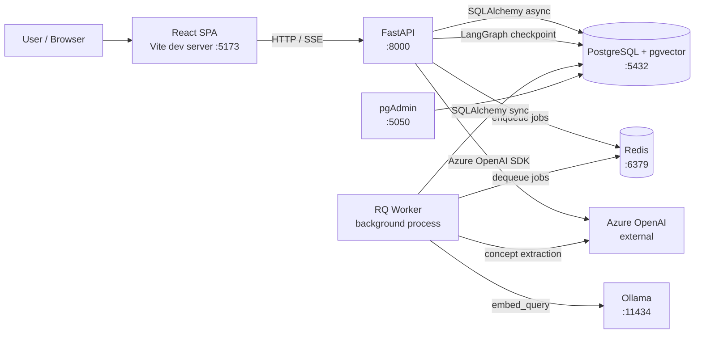
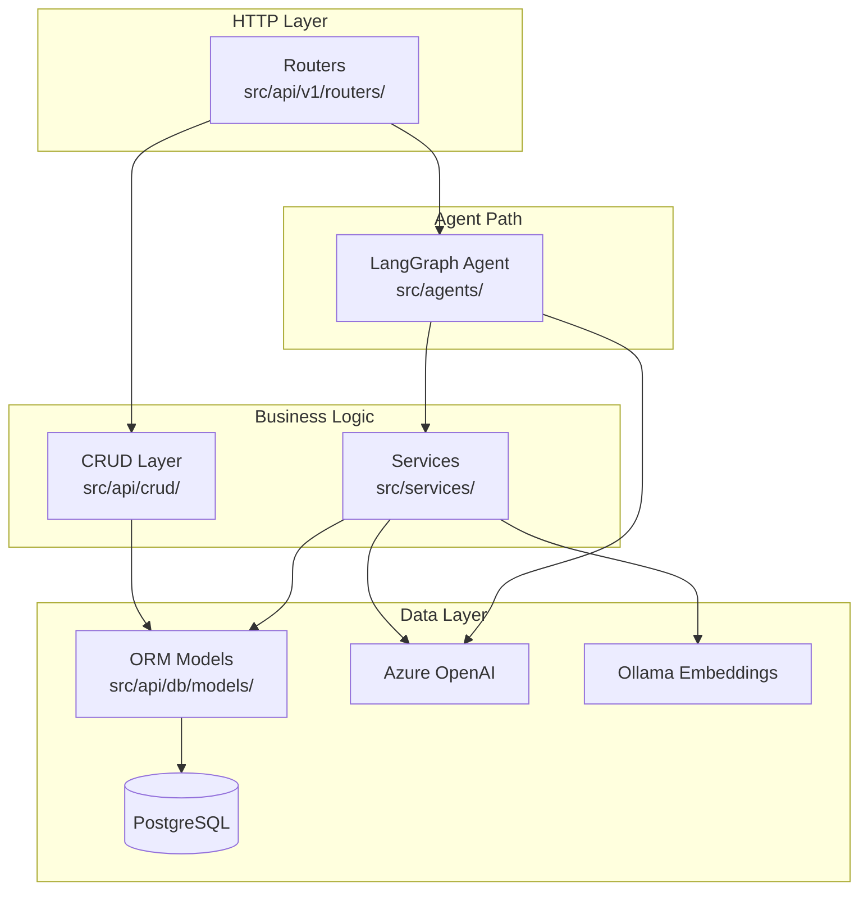
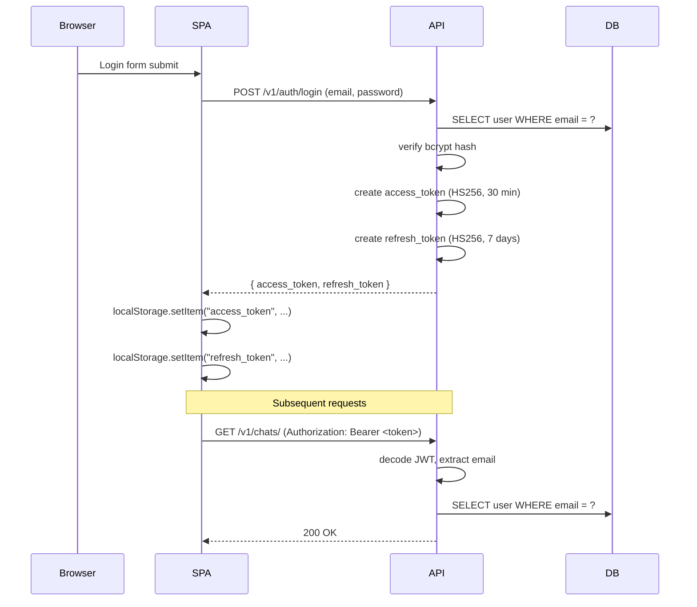
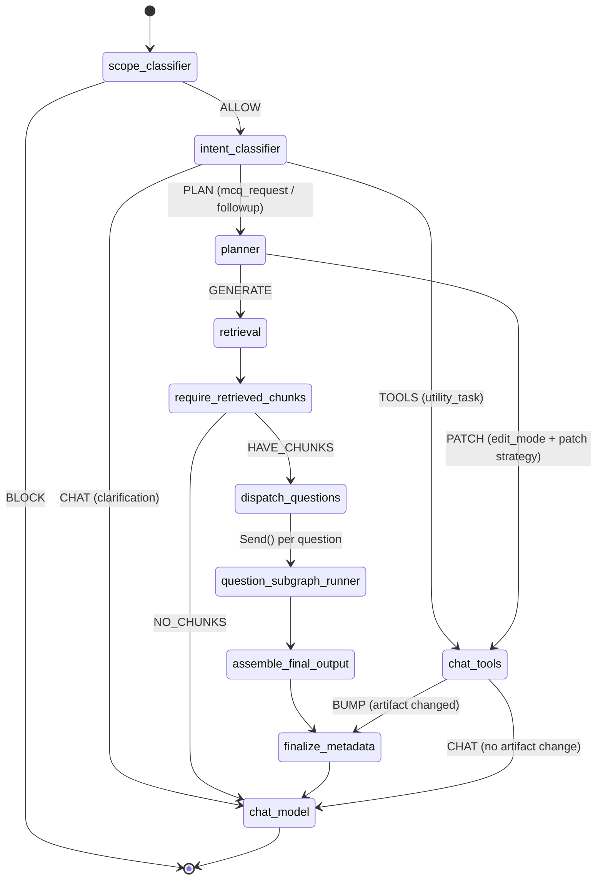
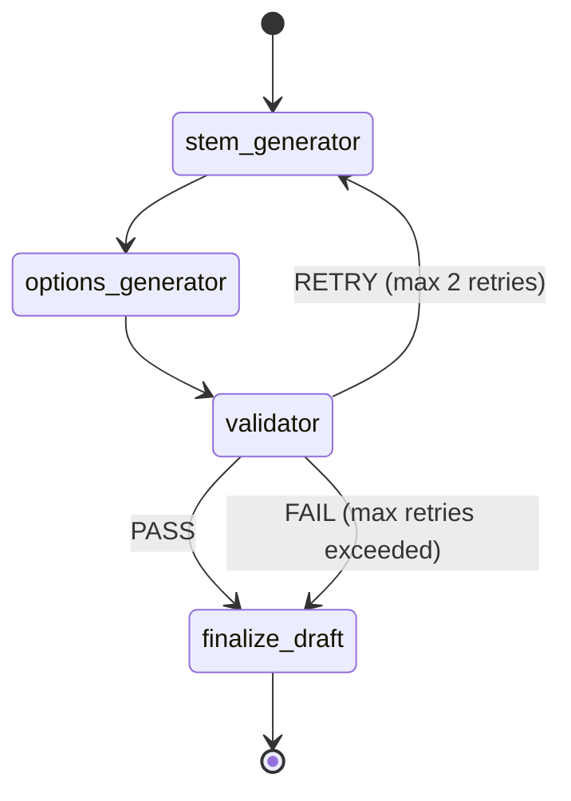
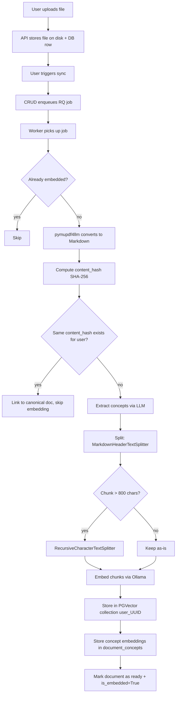
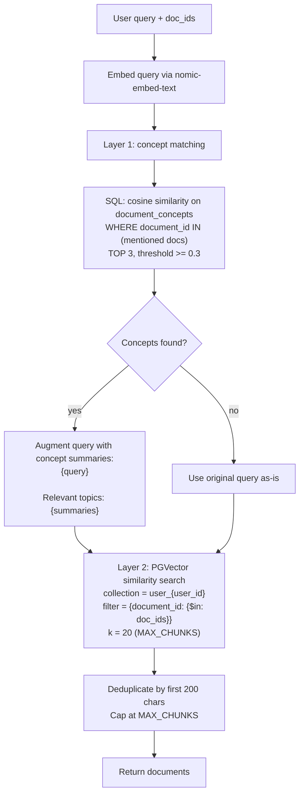
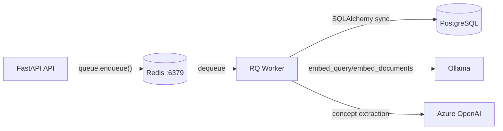

# ARCHITECTURE.md

## TL;DR

Otis is a Docker Compose-deployed application consisting of a React SPA, a FastAPI backend (with an in-process LangGraph agent), a PostgreSQL database with pgvector, an Ollama embedding server, and a Redis-backed RQ worker for background embedding tasks. There is no service mesh, API gateway, CI/CD pipeline, or production hardening. The system is in active prototyping phase and trades operational maturity for iteration speed.

---

## Assumptions

Before reading this document, be aware of these assumptions made during its writing:

1. The `.env` and `.env.fastapi` files exist and contain all required secrets (JWT key, DB URL, Azure OpenAI credentials). These are not checked into version control.
2. The deprecated agent graph (`src/agents/graph.py`) is still compiled at startup in `lifespan()` but is effectively dead code — the chat agent (`src/agents/chat_agent.py`) is the active graph.
3. Azure OpenAI is the LLM provider for all agent nodes. Ollama is used exclusively for embeddings (`nomic-embed-text`).
4. The frontend runs on a separate dev server (Vite, port 5173) during development and is not served by FastAPI.
5. There is no Alembic or other migration framework — migrations are raw SQL files applied manually.
6. The `langchain_pg_collection` and `langchain_pg_embedding` tables are managed by the LangChain PGVector library, not by Otis directly.
7. LangGraph checkpoint tables are auto-created by `AsyncPostgresSaver.setup()` in the same database.
8. The `Dockerfile.agent` exists but the agent service is not present in `docker-compose.yml` — it was removed in favor of running the agent in-process.

---

## 3.1 System Context Diagram



### How the pieces connect

The user interacts with a React single-page application served by Vite during development (no production build/serve pipeline exists). The SPA communicates with the FastAPI backend over HTTP REST and Server-Sent Events (SSE).

The FastAPI process does two things: it serves the REST/SSE API and it runs the LangGraph agent in-process — there is no separate agent service. The API process connects to PostgreSQL (with the pgvector extension) for persistent storage and to Redis for job enqueueing.

The RQ worker is a separate process (same Docker image as the API) that pulls embedding jobs from a Redis queue. It calls Ollama for vector embeddings and Azure OpenAI for concept extraction. The worker uses synchronous SQLAlchemy (psycopg2) because RQ does not run inside an asyncio event loop.

pgAdmin is included for database inspection during development. It has no role in the application architecture.

**Reference:** `docker-compose.yml` defines all services.

---

## 3.2 Service Architecture

Six services are defined in `docker-compose.yml`. No service mesh, API gateway, or load balancer exists.

| Service   | Image / Build                  | Port  | Purpose                                          |
| --------- | ------------------------------ | ----- | ------------------------------------------------ |
| `db`      | `pgvector/pgvector:pg17`       | 5432  | PostgreSQL with pgvector extension               |
| `redis`   | `redis:7-alpine`               | 6379  | Job queue broker (RQ) and refresh token store    |
| `api`     | `Dockerfile.api` (Python 3.12) | 8000  | FastAPI application + in-process LangGraph agent |
| `worker`  | `Dockerfile.api` (same image)  | none  | RQ worker for background embedding tasks         |
| `ollama`  | `ollama/ollama:latest`         | 11434 | Local embedding model server (nomic-embed-text)  |
| `pgadmin` | `dpage/pgadmin4`               | 5050  | Database admin UI (dev-only)                     |

### Design decisions

**Agent runs in-process with API, not as a separate service.** `Dockerfile.agent` exists but the corresponding service is not in `docker-compose.yml`. The agent was consolidated into the API process for simplicity — it avoids inter-service communication, shared state problems, and deployment complexity. The trade-off is that a long-running agent invocation ties up an API worker thread.

**RQ worker is a separate process but shares the same Docker image.** The worker is started with `uv run python -m src.worker` instead of the Uvicorn command. This keeps the dependency set identical and avoids image duplication. The worker runs synchronous Python (no asyncio) because RQ's execution model is fork-based.

**Dockerfile.api is a single-stage build with no production hardening:**

```dockerfile
FROM python:3.12
WORKDIR /app
COPY --from=ghcr.io/astral-sh/uv:0.10.7 /uv /uvx /bin/
COPY pyproject.toml uv.lock ./
RUN uv sync --frozen
COPY ./src /app/src
RUN uv pip install docling==2.65.0 --extra-index-url https://download.pytorch.org/whl/cpu
EXPOSE 8000
CMD ["uv", "run", "uvicorn", "src.api.v1.main:app", "--host", "0.0.0.0", "--port", "8000"]
```

The API service overrides CMD with `--reload` for hot-reloading. No multi-stage build, no non-root user, no health check on the API container.

### Failure behavior

- If `db` is unhealthy, both `api` and `worker` will not start (health check dependency).
- If `redis` is unhealthy, `api` and `worker` will not start.
- If `ollama` is down, the worker will fail embedding jobs but the API will continue serving non-embedding requests. Ollama has `condition: service_started` (not `service_healthy`), so a slow Ollama startup can cause early worker jobs to fail.
- There is no automatic restart policy defined for any service.

---

## 3.3 Backend Layer Diagram



### Layer responsibilities

**Routers** (`src/api/v1/routers/`): HTTP request handling, input validation (via Pydantic schemas from `src/api/db/schema.py`), authentication dependency injection (`get_current_user`), response serialization. Seven router modules exist:

```text
auth.py       — registration, login, logout, token refresh, user management
chat.py       — CRUD for chats/messages, invoke endpoint (SSE), event replay
docs.py       — document upload, listing, deletion (user-scoped and project-scoped)
embeddings.py — vectorstore sync trigger, status polling
mcqs.py       — MCQ CRUD
projects.py   — project CRUD, document linking
agent.py      — deprecated graph start/resume endpoints (SSE)
```

**CRUD Layer** (`src/api/crud/`): Database operations separated from HTTP concerns. Each module maps roughly to a router: `users.py`, `chat.py`, `docs.py`, `embeddings.py`, `mcq.py`, `projects.py`. The CRUD layer handles:

- SQLAlchemy query construction
- Authorization checks (e.g., "does this user own this chat?")
- Business logic that must happen atomically with the DB write (e.g., sequence number assignment for messages, stale message cleanup)

**Services** (`src/services/`): Reusable business logic consumed by both the API routers and the LangGraph agent. Four services exist:

- `retrieval_service.py` — two-layer concept-aware RAG retrieval
- `concept_service.py` — concept extraction and chunk classification via LLM
- `embedding_service.py` — embedding model instantiation
- `file_handling.py` — file upload/storage utilities

**ORM Models** (`src/api/db/models/__init__.py`): SQLAlchemy 2.0 declarative models. All tables are defined here including junction tables (`project_docs`, `project_mcqs`).

### Why CRUD exists between routers and ORM

Routers should not contain query logic. The CRUD layer encapsulates "how to get/mutate data" so that:

1. Auth checks live next to the queries they protect (not scattered in routers).
2. Multiple routers can share the same CRUD operations.
3. Router functions stay small — they validate input, call CRUD, return output.

### Why services are separate from CRUD

Services are used by both the HTTP API path and the LangGraph agent path. If retrieval logic lived in the CRUD layer, the agent would need to import from `src/api/crud/`, creating a circular dependency between the agent and API packages. Services have no knowledge of HTTP, FastAPI, or request/response objects.

---

## 3.4 Frontend Architecture

The frontend is a React SPA at `frontend/otis-ui/` using Vite as the build tool.

### Routing

React Router v6 with `createBrowserRouter`:

```tsx
const router = createBrowserRouter([
  {
    path: "/",
    element: (
      <RequireAuth>
        <App />
      </RequireAuth>
    ),
    children: [
      { index: true, element: <ChatPage /> },
      { path: "c/:chatId", element: <ChatPage /> },
      { path: "dashboard", element: <Dashboard /> },
      { path: "projects", element: <Projects /> },
      { path: "p/:projectId", element: <ProjectDetailPage /> },
      { path: "data-library", element: <DataLibrary /> },
      { path: "vector-store", element: <VectorStore /> },
      // ... additional routes
    ],
  },
  { path: "/login", element: <LoginForm /> },
  { path: "/signup", element: <SignupForm /> },
]);
```

All authenticated routes are children of the `RequireAuth` wrapper, which checks for a valid token before rendering.

### State management strategy

| State type   | Mechanism        | Example                        |
| ------------ | ---------------- | ------------------------------ |
| Server state | TanStack Query   | Chat list, messages, documents |
| Auth state   | React context    | Current user, login/logout     |
| UI state     | Local `useState` | Modal open/close, form inputs  |
| Global store | None             | —                              |

**Reference:** `src/authContext.tsx` for auth context, `src/hooks/` for custom hooks, `src/api/queryKeys.ts` for TanStack Query key factory.

Query keys follow a factory pattern:

```typescript
export const queryKeys = {
  documents: {
    all: ["documents"] as const,
    detail: (docId: string) => ["documents", docId] as const,
  },
  chat: {
    all: ["chat"] as const,
    detail: (chatId: string) => ["chat", chatId] as const,
    messages: (chatId: string) => ["chat", chatId, "messages"] as const,
    attachments: (chatId: string) => ["chat", chatId, "attachments"] as const,
  },
};
```

### Design decisions

**No Redux/Zustand.** The project is small enough that TanStack Query (for server-state cache and refetching) plus React context (for auth) covers all needs. Adding a global store would increase boilerplate without measurable benefit at current scale.

**shadcn/ui for components.** Components are copied into the project (not imported from a package), giving full control over styling and behavior. This avoids version-lock issues with third-party component libraries.

### What is missing

- No error boundary components — an unhandled error in any route crashes the entire SPA.
- No shared types between frontend and backend. TypeScript interfaces in `src/api/chatApi.ts` are manually kept in sync with Pydantic schemas.
- No code splitting / lazy loading — all routes are eagerly imported.

---

## 3.5 Authentication & Authorization

### JWT flow



### Backend auth flow

Every protected endpoint declares `current_user: AuthResponse = Depends(get_current_user)` as a dependency.

```python
# src/core/security.py
async def get_current_user(
    token: str = Depends(oauth2_scheme),
    db: AsyncSession = Depends(get_db),
) -> AuthResponse:
    payload = decode_token(token, expected_type="access")
    email = payload.get("sub")
    user = await db.execute(select(Users).where(Users.email == email))
    return AuthResponse(user_id=..., email=..., uname=..., role=...)
```

For project-scoped routes, `verify_project_access` checks ownership:

```python
async def verify_project_access(
    project_id: uuid.UUID,
    current_user: AuthResponse = Depends(get_current_user),
    db: AsyncSession = Depends(get_db),
) -> Projects:
    project = await db.get(Projects, project_id)
    if current_user.role != "admin" and project.created_by != current_user.user_id:
        raise HTTPException(404)
    return project
```

Admin role bypasses the ownership check. There is no RBAC system — `role` is a simple string column with values `"admin"` or `"user"`.

### Frontend auth flow

The Axios instance in `src/api/authApi.ts` attaches the token to every request via an interceptor:

```typescript
api.interceptors.request.use((config) => {
  const token = localStorage.getItem("access_token");
  if (token) {
    config.headers.Authorization = `Bearer ${token}`;
  }
  return config;
});
```

A response interceptor catches 401 errors and attempts a single token refresh before retrying:

```typescript
// On 401: call POST /v1/auth/refresh with the stored refresh_token
// If refresh succeeds: retry the original request with the new access_token
// If refresh fails: redirect to /login
```

### Design decisions and known gaps

**Refresh token rotation is implemented.** The refresh endpoint validates the current refresh JTI, issues a new refresh token with a new JTI, and replaces the stored JTI in Redis (or the in-memory fallback store). Old refresh tokens are single-use and rejected after rotation.

**No server-side session store.** Auth state is entirely JWT-based. There is no session table. Logging out revokes the refresh JTI in Redis but cannot invalidate already-issued access tokens (they remain valid until expiry).

**Tokens in localStorage.** This is vulnerable to XSS. httpOnly cookies would be more secure but require CSRF protection. This is a known trade-off for development simplicity.

**Admin as a simple role flag, not RBAC.** The `role` column on `users` is either `"admin"` or `"user"`. There are no permissions, scopes, or role hierarchies. Admin status is checked with `current_user.role != "admin"` in scattered locations.

---

## 3.6 Database Schema

```mermaid
erDiagram
    users ||--o{ documents : "owns"
    users ||--o| user_vectorstores : "has one"
    documents ||--o{ document_concepts : "has"
    documents ||--o{ project_docs : "linked via"
    documents ||--o{ chat_message_documents : "referenced by"
    documents ||--o| documents : "canonical_document_id"
    projects ||--o{ project_docs : "linked via"
    projects ||--o{ project_mcqs : "linked via"
    mcqs ||--o{ project_mcqs : "linked via"
    user_vectorstores ||--o| langchain_pg_collection : "references"
    langchain_pg_collection ||--o{ langchain_pg_embedding : "contains"
    chats ||--o{ chat_messages : "contains"
    chat_messages ||--o{ chat_message_events : "has"
    chat_messages ||--o{ chat_message_documents : "references"
    users ||--o{ chats : "owns"

    users {
        uuid user_id PK
        text email UK
        text hashed_password
        string uname
        text role "admin or user"
        datetime created_at
        boolean is_active
    }

    documents {
        uuid doc_id PK
        uuid user_id FK
        string filename
        string file_type
        int file_size
        string file_path
        text content_md "full markdown after Docling parse"
        string content_hash "SHA-256 of normalized markdown"
        string file_hash "SHA-256 of raw file bytes"
        string status "pending|processing|ready|failed"
        uuid canonical_document_id FK "self-ref for dedup"
        boolean is_embedded
        datetime embedded_at
        datetime created_at
        datetime updated_at
    }

    user_vectorstores {
        uuid user_id PK_FK
        uuid collection_id FK "nullable"
        int document_count
        string status "pending|processing|ready|failed"
        string job_id
        text error_message
        datetime last_synced_at
        datetime created_at
    }

    document_concepts {
        uuid concept_id PK
        uuid document_id FK
        text concept_name
        text concept_summary
        vector concept_embedding "VECTOR(768)"
        text extractor_version
        datetime created_at
    }

    langchain_pg_collection {
        uuid uuid PK
        string name UK
        json cmetadata
    }

    langchain_pg_embedding {
        string id PK
        uuid collection_id FK
        vector embedding "VECTOR"
        string document "chunk text"
        jsonb cmetadata "user_id, document_id, source, file_name"
    }

    projects {
        uuid project_id PK
        string project_name
        uuid created_by
        string project_desc
        datetime created_at
    }

    project_docs {
        uuid project_id PK_FK
        uuid doc_id PK_FK
    }

    mcqs {
        uuid mcq_id PK
        jsonb mcq "full MCQ payload"
        datetime generated_at
    }

    project_mcqs {
        uuid project_id PK_FK
        uuid mcq_id PK_FK
    }

    chats {
        uuid chat_id PK
        uuid user_id FK
        text status "active|archived|deleted"
        int total_input_tokens
        int total_output_tokens
        text title
        datetime created_at
        datetime updated_at
        datetime last_message_at
        datetime deleted_at
    }

    chat_messages {
        uuid message_id PK
        uuid chat_id FK
        text role "user|assistant|tool"
        int sequence
        text status "pending|streaming|completed|failed"
        text content
        jsonb structured_data
        int input_tokens
        int output_tokens
        jsonb error
        datetime created_at
    }

    chat_message_events {
        uuid event_id PK
        uuid message_id FK
        int seq "per-message monotonic"
        text event_type "started|thinking|token_chunk|reasoning_token|done|error"
        text content
        jsonb metadata
        datetime created_at
    }

    chat_message_documents {
        uuid cmd_id PK
        uuid message_id FK
        uuid doc_id FK
        datetime created_at
    }

    concept_cache {
        uuid cache_id PK
        string content_hash
        string extractor_version
        jsonb concepts
        datetime created_at
        datetime expires_at "90 day TTL"
    }

    mcq_cache {
        uuid cache_id PK
        string concept_set_id
        string generator_version
        string params_hash
        jsonb mcqs
        datetime created_at
        datetime expires_at "90 day TTL"
    }
```

### Table descriptions

**`users`** — User accounts. `role` is `"admin"` or `"user"`. One user has zero or one vectorstore and zero or more documents.

**`documents`** — Uploaded files. Owned by a user (not a project). A document can be linked to multiple projects via `project_docs`. The `content_md` column stores the full Docling-parsed markdown. `content_hash` is the SHA-256 of the normalized markdown text, used for content-level deduplication. `canonical_document_id` is a self-referencing FK — when two documents have identical content, the later upload points to the earlier one and skips re-embedding.

**`user_vectorstores`** — One row per user. Tracks the user's single PGVector collection. The `collection_id` FK points to `langchain_pg_collection`. Status tracks the embedding pipeline state.

**`document_concepts`** — Pre-extracted concepts per document. Each row stores a concept name, summary, and its 768-dimensional vector embedding (nomic-embed-text). Used as Layer 1 in two-layer retrieval. Indexed with IVFFlat for approximate nearest neighbor search.

**`langchain_pg_collection` / `langchain_pg_embedding`** — Managed by the LangChain PGVector library. `langchain_pg_embedding.cmetadata` stores `user_id`, `document_id`, `source`, and `file_name` per chunk. Do not modify these tables directly.

**`projects`** — User-created project containers. `created_by` references `users.user_id` but has no FK constraint (schema gap).

**`project_docs` / `project_mcqs`** — Junction tables for many-to-many relationships. A document can belong to multiple projects. An MCQ set can be linked to multiple projects.

**`chats`** — Chat sessions. Owned by a user. Tracks aggregate token counts.

**`chat_messages`** — Individual messages within a chat. `sequence` is a per-chat monotonic integer. `status` tracks the message lifecycle: `pending` -> `streaming` -> `completed` (or `failed`).

**`chat_message_events`** — Persistent streaming events for assistant messages. Each event has a per-message `seq` (monotonic, unique). Used for SSE replay and resumable streaming. The `event_type` column is unconstrained text — new event types can be added without DDL changes.

**`chat_message_documents`** — Links messages to their referenced documents (from `@`-mentions in the chat UI).

**`concept_cache` / `mcq_cache`** — LLM output caches with 90-day TTL. Keyed by content hash to avoid redundant extraction/generation calls.

### Design decisions

**Per-user vectorstores, not per-project.** A user uploads documents and they get a single PGVector collection named `user_{user_id}`. When documents are linked to projects, the project-specific views filter by `document_id` from the `project_docs` junction table. This avoids duplicating embeddings when the same document appears in multiple projects.

**LangGraph checkpoint tables in same schema.** `AsyncPostgresSaver.setup()` creates `checkpoint` and `checkpoint_blobs` tables (and possibly others) in the same database. These are managed by LangGraph and should not be modified.

**Junction tables for project-document and project-MCQ relationships.** This is a standard many-to-many pattern. The alternative (documents belonging to projects directly) was abandoned when the vectorstore model changed from per-project to per-user.

**GAP: No formal migration framework.** Schema changes are tracked in `migrations/` as raw SQL files. There is no Alembic, no migration versioning, no rollback support. The ORM models and the migration files may diverge. When making schema changes, update both the ORM model in `src/api/db/models/__init__.py` AND create a new migration file.

---

## 3.7 LangGraph Agent Architecture

The active agent is defined in `src/agents/chat_agent.py`. A deprecated graph in `src/agents/graph.py` is still compiled at startup but should not be used for new work.

### Graph topology



### Node descriptions

| Node                       | File                            | Purpose                                                                                                                                           |
| -------------------------- | ------------------------------- | ------------------------------------------------------------------------------------------------------------------------------------------------- |
| `scope_classifier`         | `src/agents/nodes/scope.py`     | Entry guardrail. Classifies user message as `ALLOW` or `BLOCK`. Uses `gpt-4.1-nano`. Blocked messages terminate immediately with no response.     |
| `intent_classifier`        | `src/agents/nodes/intent.py`    | Routes to `PLAN` (MCQ generation), `TOOLS` (utility tasks), or `CHAT` (general conversation). Uses `gpt-4.1-nano`.                                |
| `planner`                  | `src/agents/nodes/planner.py`   | Creates a `TestGenerationPlan` with topic, difficulty, Bloom's level, number of questions, distractor strategy, and retrieval queries.            |
| `retrieval`                | `src/agents/nodes/retrieval.py` | Executes retrieval queries against the user's vectorstore. Populates `retrieved_chunks` in state.                                                 |
| `require_retrieved_chunks` | inline in `chat_agent.py`       | Gate node. If no chunks were retrieved, routes to `chat_model` with an error message instead of attempting MCQ generation.                        |
| `dispatch_questions`       | inline in `chat_agent.py`       | No-op node. Its outgoing edge uses `question_fanout_router` to emit `Send()` messages — one per question index — for parallel subgraph execution. |
| `question_subgraph_runner` | inline in `chat_agent.py`       | Invokes the MCQ question subgraph (see below). Collects the `MCQDraft` result.                                                                    |
| `assemble_final_output`    | `src/agents/nodes/output.py`    | Merges all `MCQDraft` objects from parallel subgraph runs into `final_mcqs`.                                                                      |
| `finalize_metadata`        | `src/agents/nodes/output.py`    | Sets artifact version and metadata for the response.                                                                                              |
| `chat_model`               | `src/agents/nodes/chat.py`      | Terminal generation node. Produces the streamed assistant response. Uses `gpt-4.1-nano` with `streaming=True`.                                    |
| `chat_tools`               | `src/agents/nodes/chat.py`      | Tool-calling node for utility tasks (and MCQ edit/patch operations).                                                                              |

### MCQ question subgraph

Each question is generated by an independent subgraph invoked via LangGraph's `Send()` fan-out:



| Node                | Purpose                                                                           |
| ------------------- | --------------------------------------------------------------------------------- |
| `stem_generator`    | Generates the question stem from retrieved chunks + plan context.                 |
| `options_generator` | Generates 4 options (A-D) with one correct answer and 3 distractors.              |
| `validator`         | Validates the question against quality criteria. Returns pass/fail with feedback. |
| `finalize_draft`    | Packages the result as an `MCQDraft` object.                                      |

The subgraph retries up to 2 times on validation failure (`_SUBGRAPH_MAX_RETRIES = 2`). On the third failure, the draft is finalized as-is with the validation feedback attached.

### State definition

The main graph state is defined in `src/agents/utils/state.py` as a `TypedDict`:

```python
class State(TypedDict, total=False):
    before_agent_guardrail: BeforeAgentGuardrail
    intent: IntentClassification
    messages: Annotated[List[ChatMessage], add]  # append-only
    user_prompt: str
    user_id: str
    doc_ids: List[uuid.UUID]
    retrieved_chunks: List[RetrievedChunk]
    plan: TestGenerationPlan
    mcq_drafts: Annotated[List[MCQDraft], add]  # append-only (fan-in)
    final_mcqs: List[FinalMCQ]
    edit_mode: bool
    edit_target: Literal["all", "specific"]
    edit_indices: List[int]
    edit_strategy: Literal["regenerate", "patch"]
    # ... additional fields
```

The `Annotated[..., add]` fields (`messages`, `mcq_drafts`) use the `operator.add` reducer, meaning parallel subgraph results are concatenated during fan-in.

### Design decisions

**Why LangGraph.** The MCQ pipeline requires: (1) a state machine with conditional routing, (2) fan-out/fan-in for parallel question generation, (3) checkpointing for long-running operations, and (4) streaming support for token-by-token SSE delivery. LangGraph provides all four out of the box.

**Why per-question subgraphs.** Each question is generated independently so they can run in parallel. If one question fails validation, only that question retries — the others are unaffected. This also allows targeted regeneration of specific questions via `edit_indices`.

**Scope classifier as entry guardrail.** Every user message passes through scope classification before any other processing. If blocked, the graph terminates immediately with no LLM generation cost. This prevents prompt injection and off-topic abuse.

**Prompt/graph tension to resolve (requires code check).** The current scope-classifier prompt text says to ALLOW only quiz/test/MCQ generation, while graph topology includes `clarification -> chat_model` and `utility_task -> chat_tools` routes for broader conversations/tasks. One of these must change: either relax the prompt behavior to align with the graph, or remove dead routes if strict MCQ-only blocking is intended.

### LLM model assignments

All models are configured in `src/agents/utils/llm_config.py`:

```python
guardrail_llm   = ChatOpenAI(model="gpt-4.1-nano")
intent_llm       = ChatOpenAI(model="gpt-4.1-nano")
planner_llm      = ChatOpenAI(model="gpt-4.1-nano")
stem_llm         = ChatOpenAI(model="gpt-4.1-nano")
options_llm      = ChatOpenAI(model="gpt-4.1-nano")
validator_llm    = ChatOpenAI(model="gpt-4.1-nano")
chat_no_tools_llm = ChatOpenAI(model="gpt-4.1-nano", streaming=True)
```

All agent nodes currently use `gpt-4.1-nano`. Each alias is separately configurable — swap any model name without touching node code.

---

## 3.8 Embedding & RAG Pipeline

### Document ingestion flow



### Exact strategies and parameters

**Document conversion:** `pymupdf4llm.to_markdown(file_path)` converts PDF content into markdown for downstream hashing, concept extraction, and chunking.

**Content-hash deduplication:** SHA-256 of the normalized markdown text (via `src/core/hashing.compute_content_hash`). If another document by the same user has the same `content_hash` and is already embedded, the new document is linked to the canonical via `canonical_document_id` and skips embedding entirely.

**Concept extraction:** Azure OpenAI `gpt-4.1-nano` with structured output (`ExtractedConcepts` Pydantic model). Extracts 3-10 concepts per document. Input truncated to 200,000 characters. Non-fatal — if extraction fails, chunks are embedded without concept tags.

**Markdown splitting:** Two-pass approach:

1. `MarkdownHeaderTextSplitter` splits on `#`, `##`, `###` headers.
2. For any resulting chunk exceeding 800 characters, `RecursiveCharacterTextSplitter` further splits with `chunk_size=800` and `chunk_overlap=100`.

**Embedding model:** `nomic-embed-text` via Ollama. Produces 768-dimensional vectors.

**Vector storage:** LangChain `PGVector` with collection name `user_{user_id}`. Chunk metadata includes `user_id`, `document_id`, `source`, and `file_name`.

**Retrieval DB connection env vars:** Retrieval uses `RETRIEVAL_DATABASE_URL` when set, and otherwise falls back to `REDIS_DATABASE_URL` (legacy name used as a PGVector URL fallback in code).

**Concept embedding storage:** Each extracted concept's summary is embedded with the same `nomic-embed-text` model and stored in `document_concepts.concept_embedding` (VECTOR(768)). Indexed with IVFFlat (`lists=100`, `vector_cosine_ops`).

### Retrieval flow (two-layer concept-aware)



**Layer 1 parameters:**

- `CONCEPT_TOP_K = 3`
- `CONCEPT_SCORE_THRESHOLD = 0.3` (cosine similarity, 0-1 scale)
- Scoped to mentioned `doc_ids` only

**Layer 2 parameters:**

- `MAX_CHUNKS = 20` (from `settings.max_retrieved_chunks`)
- Metadata filter: `{"document_id": {"$in": [doc_id_strings]}}`
- Query augmentation: original query + `\n\nRelevant topics: {concept_summaries joined by "; "}`

**Fallback behavior:** If Layer 1 finds no concepts above threshold (or if `document_concepts` is empty for the mentioned docs), Layer 2 runs with the unaugmented query. If Layer 2 itself fails (exception), an empty list is returned silently.

**Deduplication:** First 200 characters of `page_content` are used as a dedup key. This is a rough heuristic — two chunks with identical first 200 chars but different tails will be incorrectly deduplicated.

### Failure modes

- **Ollama down during embedding:** The RQ job fails. `vectorstore_record.status` is set to `"failed"`, `error_message` is populated. The document `status` remains `"processing"` (not reset to `"pending"` — this is a bug).
- **Azure OpenAI down during concept extraction:** Non-fatal. Concepts are not extracted, chunks are embedded without concept tags. Retrieval falls back to pure similarity search.
- **`pymupdf4llm` fails to parse a document:** That specific document is marked as `"failed"`. Other documents in the same batch continue processing.

---

## 3.9 Background Task System

### Architecture



Single worker, single queue (`"default"`), Redis broker.

### Worker setup

```python
# src/worker.py
redis_conn = Redis.from_url(os.getenv("REDIS_URL", "redis://localhost:6379/0"))
worker = Worker(
    [Queue("default", connection=redis_conn)],
    connection=redis_conn,
)
worker.work()
```

The worker is started via `uv run python -m src.worker`. It runs synchronously — no asyncio event loop.

### Task registration

Tasks are enqueued from `src/api/crud/embeddings.py`:

```python
redis_conn = Redis.from_url(os.getenv("REDIS_URL", "redis://localhost:6379/0"))
queue = Queue("default", connection=redis_conn)

# Enqueueing happens in sync_user_embeddings():
job = queue.enqueue(
    process_user_embeddings,
    user_id=str(user_id),
    collection_name=collection_name,
    document_ids=[str(d.doc_id) for d in docs_to_embed],
    file_paths=[d.file_path for d in docs_to_embed],
)
```

The only task function is `process_user_embeddings` in `src/tasks/embedding_tasks.py`.

### Failure handling

- RQ's default failure handler moves the job to the `failed` queue.
- The task function has a `try/except` that sets `vectorstore_record.status = "failed"` and `error_message = str(e)` before re-raising.
- Individual document failures within a batch are caught — the document is marked as `"failed"` and processing continues with the remaining documents.
- There is no retry mechanism. Failed jobs stay in the failed queue until manually inspected.

### Status reporting

The API exposes vectorstore status via `GET /v1/embeddings/status` (in `src/api/v1/routers/embeddings.py`). This reads from the `user_vectorstores` table and the `documents` table to report counts.

### Design decisions

**RQ over Celery.** The system has exactly one worker, one queue, and one task type. Celery's multi-broker, multi-worker, task routing, and rate limiting features are unnecessary overhead. RQ's simplicity (single file, straightforward API) is a better fit for this scale.

**Synchronous worker.** The RQ worker runs synchronous Python because: (1) RQ does not natively support async task functions, (2) the embedding pipeline is CPU/IO-bound (Docling parsing, Ollama HTTP calls), not concurrency-bound, and (3) the worker creates its own synchronous SQLAlchemy engine (converting the async `DATABASE_URL` to a sync connection string).

---

## 3.10 SSE Streaming Protocol

Two distinct SSE protocols exist in the system.

### Protocol 1: Chat invoke (`POST /v1/chats/{chat_id}/invoke`)

Used by the active chat system. The response is `text/event-stream`. Each line is prefixed with `data: ` followed by a JSON object, terminated by `\n\n`.

**Event lifecycle:**

```text
data: {"event": "started", "user_message": {...}, "assistant_message_id": "..."}
data: {"event": "thinking", "node": "document_search", "status": "started", "label": "..."}
data: {"event": "thinking", "node": "document_search", "status": "completed", ...}
data: {"event": "thinking", "node": "scope_classifier", "status": "started", ...}
data: {"event": "thinking", "node": "scope_classifier", "status": "completed", ...}
data: {"event": "token", "content": "The"}
data: {"event": "token", "content": " answer"}
data: {"event": "token", "content": " is"}
...
data: {"event": "done", "assistant_message": {...}}
```

**Event types:**

| Event             | Payload                                                      | When emitted                                                               |
| ----------------- | ------------------------------------------------------------ | -------------------------------------------------------------------------- |
| `started`         | `user_message` (full message object), `assistant_message_id` | Once, at stream start                                                      |
| `thinking`        | `node`, `status` (started/completed), `label`, `detail`      | Per LangGraph node entry/exit (via `stream_mode=["custom"]`)               |
| `reasoning_token` | `content`, `node`                                            | For OpenAI o-series reasoning or Anthropic thinking blocks                 |
| `token`           | `content`                                                    | Per token from generation nodes (`chat_model`, `naive_mcq_generator_node`) |
| `done`            | `assistant_message` (full updated message object)            | Once, at stream end                                                        |
| `error`           | `detail`                                                     | Once, on failure                                                           |

**Token filtering:** Only tokens from nodes in `_GENERATION_NODES = {"chat_model", "naive_mcq_generator_node"}` are emitted as `token` events. Tokens from guardrail, planning, and retrieval nodes (which produce structured output, not chat text) are silently dropped.

### Event persistence

Every SSE event is simultaneously persisted to `chat_message_events` with a monotonic `seq` number managed by `EventSequencer`:

```python
class EventSequencer:
    def __init__(self, start: int = 1):
        self._seq = start

    def next(self) -> int:
        seq = self._seq
        self._seq += 1
        return seq
```

Token events are batched by `TokenChunkBuffer` before persistence (not before SSE emission):

```python
class TokenChunkBuffer:
    # Flushes when buffer reaches chunk_size (default 50 chars)
    # OR when flush_ms elapsed since last flush (default 200 ms)
    def add(self, token: str) -> Optional[PendingChunk]: ...
    def flush_if_stale(self) -> Optional[PendingChunk]: ...
    def flush_final(self) -> Optional[PendingChunk]: ...
```

SSE delivers every token individually for responsiveness. Persistence batches tokens into ~50-character chunks to reduce database row count. On stream completion (or error), `flush_final()` persists any remaining buffered text.

### Event replay (`GET /v1/chats/{chat_id}/messages/{message_id}/events`)

Supports resumable streaming via `after_seq` query parameter:

- **Completed/failed message:** Returns a `ChatMessageEventReplayResponse` JSON object containing all events and `is_complete: true`.
- **In-progress message:** Returns an SSE stream that first emits all stored events, then polls every 500ms for new events until the message reaches a terminal state.

The replay endpoint converts stored events back into the same SSE format used by the live stream, so the client uses one handler for both live and replayed events.

### Protocol 2: Agent graph (`POST /v1/graph/start`, `POST /v1/graph/resume/{thread_id}`)

Used by the deprecated agent graph (for the concept extraction/approval flow). The response is `text/event-stream` with the format:

```text
data: {"mode": "custom", "payload": {"status": "...", "overview": [...], ...}}
```

Each line is `data: ` + JSON with two fields: `mode` (always `"custom"`) and `payload` (arbitrary dict). The payload structure varies by node — there are no standardized event types.

The `X-Thread-ID` header is returned on the response to allow the client to resume the graph (which uses LangGraph's interrupt/resume with human-in-the-loop).

### Design decisions

**Event sourcing in `chat_message_events` for reliable replay.** Every event during message generation is persisted with a monotonic sequence number. This enables: (1) clients to reconnect mid-stream and resume from `after_seq`, (2) full replay of the generation process for debugging, (3) rendering of thinking/reasoning steps after the fact.

**Monotonic sequence numbers.** The `(message_id, seq)` pair is unique (enforced by DB constraint). Sequence numbers are assigned by `EventSequencer` in the API process, not the database. This works because a single message is generated by a single API process. If multi-process generation were needed, this would break.

**`TokenChunkBuffer` for batching small tokens.** Without buffering, a 500-token response would create 500 rows in `chat_message_events`. With the default 50-char chunk size, this reduces to ~50 rows. The buffer flushes on either size threshold (50 chars) or time threshold (200ms), whichever comes first.

### Failure behavior

- If the database is unavailable during persistence, events are dropped silently (best-effort persistence). The SSE stream continues.
- If the LLM stream errors mid-generation, an `error` event is emitted, the message status is set to `"failed"`, and the partially generated text is lost (the `content` column of the assistant message is set to whatever was accumulated so far, but only if the update succeeds).
- The `flush_pending()` mechanism batches DB writes every 5 events. An API crash between flushes loses up to 4 events.

---

## 3.11 Deployment Model

### Current state

Docker Compose is the only deployment mechanism. There is no CI/CD pipeline, no container registry, no staging environment.

```yaml
# docker-compose.yml — key dev-mode indicators:
command: uv run uvicorn src.api.v1.main:app --host 0.0.0.0 --port 8000 --reload
# --reload enables hot-reloading on code changes

volumes:
  - ./src:/app/src # Source code mounted for hot-reload
  - ./uploads:/app/uploads
  - ./thumbnails:/app/thumbnails

env_file:
  - .env
  - .env.fastapi # Contains secrets in plaintext
```

### What is not production-ready

| Area                 | Current state                                                      | Production requirement                    |
| -------------------- | ------------------------------------------------------------------ | ----------------------------------------- |
| Dockerfile           | Single-stage, runs as root                                         | Multi-stage build, non-root user          |
| Secrets              | `.env` files, plaintext                                            | Vault, K8s secrets, or cloud KMS          |
| TLS                  | None                                                               | TLS termination at reverse proxy          |
| CORS                 | `allow_origins=["http://localhost:3000", "http://localhost:5173"]` | Restrict to actual domain                 |
| Database credentials | In `.env`, shared across services                                  | Per-service credentials, rotation         |
| Logging              | `print()` + basic `logging`                                        | Structured logging, log aggregation       |
| Monitoring           | None                                                               | Health checks, metrics, alerting          |
| Restart policy       | None specified                                                     | `restart: unless-stopped` or orchestrator |
| Frontend             | Vite dev server                                                    | Static build served by nginx/CDN          |
| Database backups     | None                                                               | Automated backup schedule                 |
| Horizontal scaling   | Not possible (stateful worker, single-process seq)                 | Stateless API, distributed task queue     |

### Design decisions

**Dev-first deployment.** The `--reload` flag, volume mounts, `echo=True` in SQLAlchemy (if enabled), and hardcoded localhost URLs are all development conveniences. The system was built for fast iteration, not for production traffic.

**GAP: No production deployment documentation or configuration exists.** Transitioning to production would require: a reverse proxy (nginx/Caddy), TLS certificates, a production Dockerfile, a secrets management solution, database connection pooling (PgBouncer), and a frontend production build pipeline.

---

## 3.12 Known Architectural Limitations

| #   | Limitation                                                        | Impact                                                                                                                                                                                           | Mitigation path                                                                                                                                                                                                                                               |
| --- | ----------------------------------------------------------------- | ------------------------------------------------------------------------------------------------------------------------------------------------------------------------------------------------ | ------------------------------------------------------------------------------------------------------------------------------------------------------------------------------------------------------------------------------------------------------------- |
| 1   | No migration framework                                            | Schema drift between ORM models and database. Manual SQL application is error-prone.                                                                                                             | Adopt Alembic with autogenerate.                                                                                                                                                                                                                              |
| 2   | No shared types between frontend and backend                      | TypeScript interfaces are manually duplicated from Pydantic schemas, so drift can cause runtime errors.                                                                                          | Generate TypeScript types from OpenAPI spec (`openapi-typescript`). Until then, when changing `src/api/db/schema.py`, manually update frontend types in `frontend/otis-ui/src/api/chatApi.ts`, `frontend/otis-ui/src/api/docApi.ts`, and related API modules. |
| 3   | Test coverage is partial                                          | Backend has focused tests (e.g., `tests/test_security_tokens.py`) and frontend has Vitest configured with `src/api/authApi.test.ts`, but business-logic/integration/E2E coverage remains sparse. | Expand pytest coverage for CRUD/services and add Playwright E2E flows.                                                                                                                                                                                        |
| 4   | Single-worker embedding pipeline                                  | One RQ worker processes all embedding jobs sequentially. Large batch uploads block the queue.                                                                                                    | Add more workers, or switch to Celery with concurrency.                                                                                                                                                                                                       |
| 5   | No rate limiting                                                  | API has no request rate limits. A single client can exhaust LLM API quotas.                                                                                                                      | Add FastAPI middleware or use a reverse proxy with rate limiting.                                                                                                                                                                                             |
| 6   | No error boundaries in frontend                                   | Any unhandled React error unmounts the entire application.                                                                                                                                       | Add `<ErrorBoundary>` components at route level.                                                                                                                                                                                                              |
| 7   | No RBAC system                                                    | Only `"admin"` and `"user"` roles. No fine-grained permissions.                                                                                                                                  | Implement permission model if multi-tenant use cases arise.                                                                                                                                                                                                   |
| 8   | Tokens in localStorage                                            | Vulnerable to XSS attacks.                                                                                                                                                                       | Move to httpOnly cookies with CSRF protection.                                                                                                                                                                                                                |
| 9   | Refresh-token revocation durability depends on Redis availability | If Redis is unavailable, refresh JTI state falls back to in-memory storage and does not survive process restarts.                                                                                | Require Redis in non-dev environments and add health checks/alerts for auth state storage.                                                                                                                                                                    |
| 10  | Stale document status on worker failure                           | If the worker crashes mid-processing, documents stay in `"processing"` forever.                                                                                                                  | Add a startup cleanup job (similar to `mark_stale_messages_failed`).                                                                                                                                                                                          |
| 11  | Dedup heuristic for retrieval chunks                              | First 200 characters used as dedup key — can falsely deduplicate or miss duplicates.                                                                                                             | Use full content hash for dedup.                                                                                                                                                                                                                              |
| 12  | No aggregate user/project document quota                          | Per-file upload size limits exist (10 MB), but there is no aggregate quota per user/project.                                                                                                     | Add quota enforcement (total bytes / file count) at the API layer.                                                                                                                                                                                            |
| 13  | Synchronous PGVector retrieval                                    | `_retrieve_chunks_sync` runs in a thread executor. Under load, this exhausts the thread pool.                                                                                                    | Use async PGVector or a dedicated retrieval service.                                                                                                                                                                                                          |
| 14  | No graceful shutdown for SSE                                      | If the API process dies during streaming, the client receives no `error` or `done` event.                                                                                                        | Rely on event replay endpoint for recovery (partially implemented).                                                                                                                                                                                           |
| 15  | Agent runs in-process                                             | Long-running MCQ generation ties up a Uvicorn worker.                                                                                                                                            | Move agent execution to a separate process or use background tasks.                                                                                                                                                                                           |

These limitations are conscious trade-offs for iteration speed during the prototyping phase. They should be addressed before any production deployment.

---

## Things a First-Time Contributor Would Likely Misunderstand

1. **The two separate graph instances.** Both `compiled_graph` (deprecated agent graph from `src/agents/graph.py`) and `compiled_chat_graph` (active chat agent from `src/agents/chat_agent.py`) are compiled and assigned to `app.state` during startup. A new contributor might modify the wrong graph. The deprecated graph is only used by `POST /v1/graph/start` and `POST /v1/graph/resume/{thread_id}` — the active chat flow uses `POST /v1/chats/{chat_id}/invoke`.

2. **The worker's synchronous execution model.** The embedding task function in `src/tasks/embedding_tasks.py` uses synchronous SQLAlchemy (`create_engine`, `Session`) while the rest of the backend uses async (`create_async_engine`, `AsyncSession`). A contributor might try to `await` something in the worker code or import async CRUD functions — this will fail silently or raise errors because there is no running event loop.

3. **Per-user vs per-project data ownership.** Documents belong to users, not projects. Vectorstores are per-user, not per-project. Projects are just organizational containers that reference documents via junction tables. A contributor might assume that deleting a project deletes its documents (it does not — documents persist as user-owned resources). Similarly, embedding happens at the user level, not when documents are added to a project.
