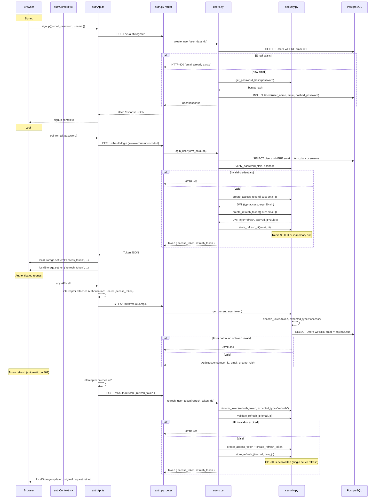
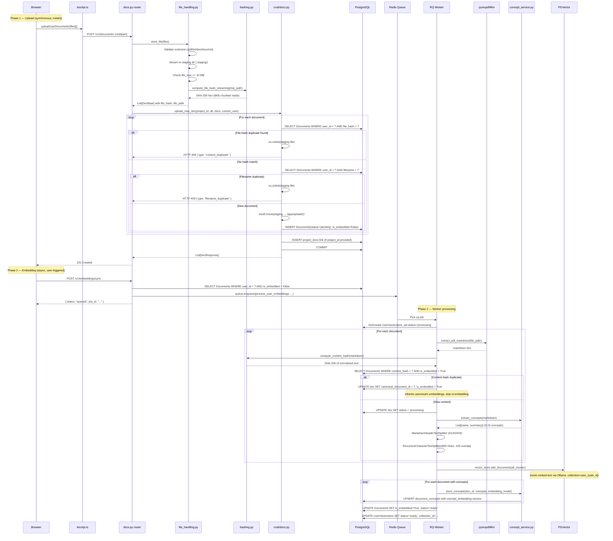
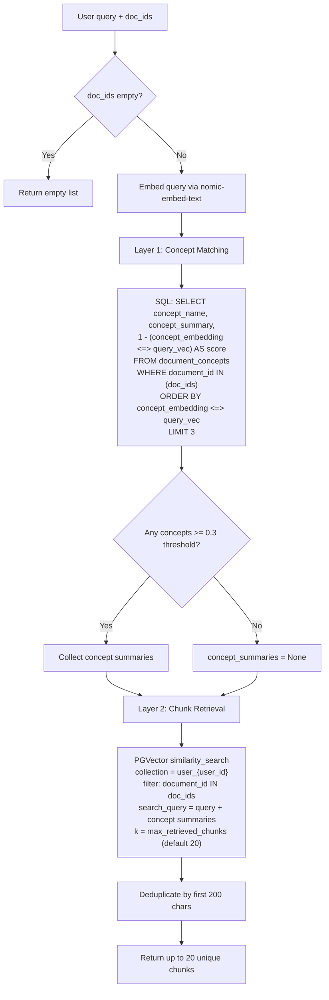
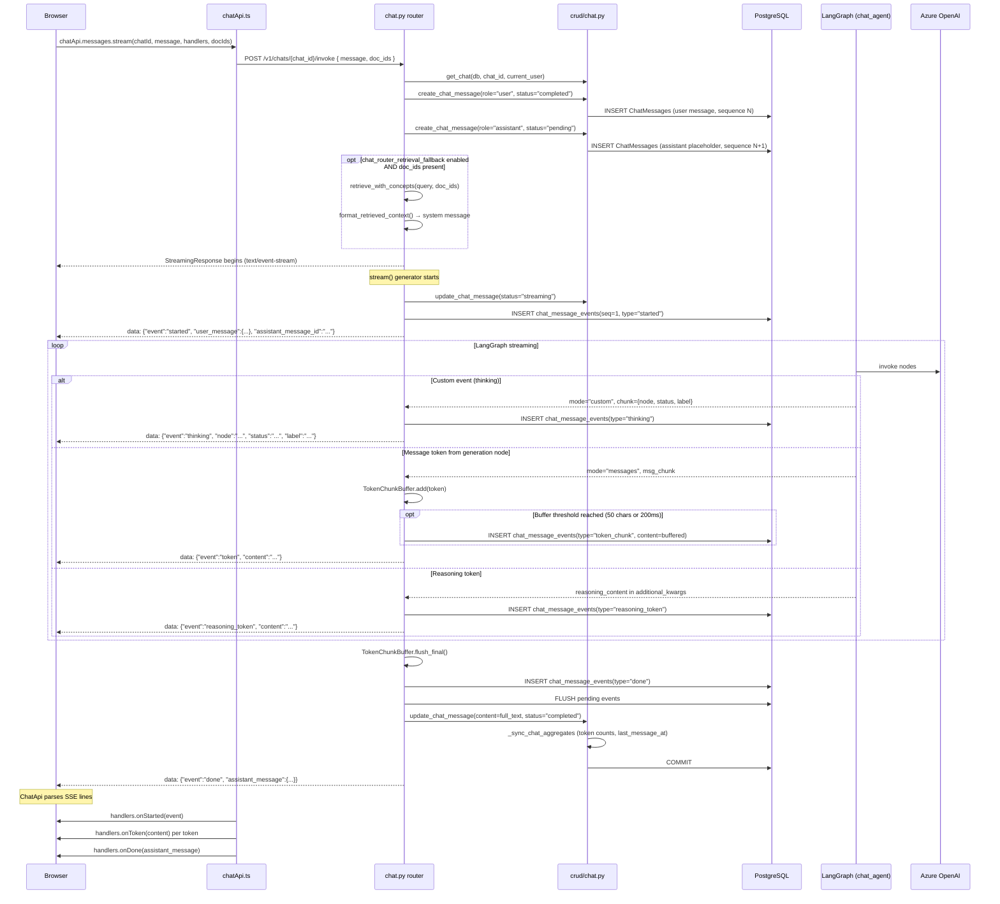
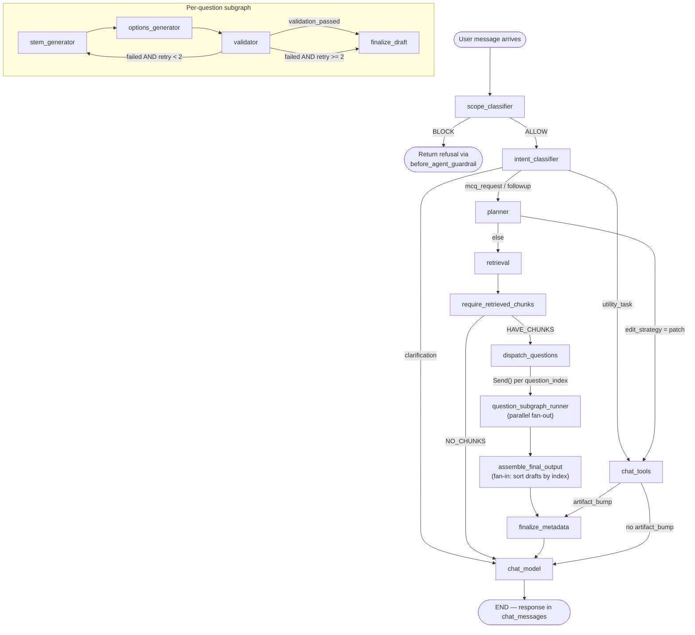

# 6. DATA_FLOW.md

**TL;DR:** This document traces every user action through the Otis system from frontend click to database write and back. It covers authentication, document upload, RAG retrieval, SSE-streamed chat invoke, the agent decision tree, background embedding tasks, and MCQ generation. Each section includes sequence diagrams, code references, failure modes, and design rationale.

---

## Assumptions

1. The database is PostgreSQL with the `pgvector` extension enabled.
2. Redis is running and accessible for both RQ job queuing and (optionally) refresh token storage.
3. Ollama is running at `OLLAMA_BASE_URL` (default `http://ollama:11434`) with the `nomic-embed-text` model loaded.
4. Azure OpenAI credentials are configured for concept extraction (`gpt-4.1-nano`) and all agent LLMs.
5. The frontend communicates with a single FastAPI backend; there is no API gateway or load balancer in the documented path.
6. A single RQ worker process handles all background embedding jobs (no horizontal scaling of workers).
7. LangGraph checkpointer uses the same PostgreSQL database as the application (via `psycopg` sync driver).
8. File uploads are stored on a local filesystem (`/app/uploads`), not object storage.
9. JWT tokens use HS256 symmetric signing; there is no public/private key pair.
10. The `chat_router_retrieval_fallback` setting controls whether pre-invoke retrieval happens at the router level versus inside the agent graph.

---

## 6.1 Authentication Flow

### Sequence Diagram



### Token Structure

```json
{
  "sub": "user@example.com",
  "exp": 1709123456,
  "typ": "access",
  "jti": "a1b2c3d4-..."
}
```

- `sub`: User email (used for DB lookup in `get_current_user`).
- `typ`: Either `"access"` or `"refresh"`. `decode_token` enforces type matching.
- `jti`: UUID4, present on both token types. Only the refresh token's JTI is stored/validated server-side.

### Failure Modes

| Scenario                           | Behavior                                                                                                                                     |
| ---------------------------------- | -------------------------------------------------------------------------------------------------------------------------------------------- |
| Expired access token               | Axios interceptor catches 401 and attempts refresh. If refresh also fails, both tokens are cleared from localStorage and user is logged out. |
| Expired refresh token              | `decode_token` raises `JWTError`. HTTP 401 returned. Client clears tokens.                                                                   |
| Concurrent 401s                    | `isRefreshing` flag in `authApi.ts` coalesces multiple parallel requests into a single refresh call via a shared `refreshPromise`.           |
| Redis unavailable                  | Falls back to in-memory `_refresh_token_store` dict. Refresh tokens do not survive server restart.                                           |
| User deleted while tokens valid    | `get_current_user` queries DB on every request; returns 401 if user row is gone.                                                             |
| Refresh token reuse after rotation | `store_refresh_jti` overwrites the previous JTI. A replayed old refresh token fails `validate_refresh_jti`.                                  |

### Code References

| File                                   | Role                                                                                        |
| -------------------------------------- | ------------------------------------------------------------------------------------------- |
| `frontend/otis-ui/src/authContext.tsx` | React context provider; holds user state, calls `fetchMe()` on mount                        |
| `frontend/otis-ui/src/api/authApi.ts`  | Axios instance with token interceptors, login/signup/logout functions                       |
| `src/api/v1/routers/auth.py`           | FastAPI router: `/register`, `/login`, `/me`, `/logout`, `/refresh`                         |
| `src/api/crud/users.py`                | DB operations: `create_user`, `login_user`, `refresh_user_token`, `logout_user`             |
| `src/core/security.py`                 | JWT creation/decode, bcrypt hashing, `get_current_user` dependency, `verify_project_access` |

---

## 6.2 Document Upload & Processing Pipeline

### Sequence Diagram



### Stage-by-Stage Prose

**Stage 1: File Validation and Staging**

Files arrive via multipart upload. `store_file()` in `src/services/file_handling.py` validates extensions against a whitelist (`pdf`, `txt`, `doc`, `docx`, `md`) and enforces a 10 MB limit. Each file is streamed into a staging directory (`/app/uploads/.staging/`) as a temp file, never loaded entirely into memory. The SHA-256 file hash is computed via `compute_file_hash_streaming()` using 8 KB chunked reads.

**Stage 2: Deduplication (Two Layers)**

The CRUD layer in `src/api/crud/docs.py` performs two dedup checks:

1. **File-hash dedup**: `SELECT Documents WHERE user_id = ? AND file_hash = ?`. If a match is found, the staged file is deleted and a 409 is returned with details of the existing document. This catches byte-identical re-uploads.
2. **Filename dedup**: `SELECT Documents WHERE user_id = ? AND filename = ?`. Catches same-name uploads (even if content differs). Returns 409 with a rename hint.

If both checks pass, the file is moved from staging to the final upload directory and a DB record is created with `status='pending'` and `is_embedded=False`.

**Stage 3: Embedding Job Enqueue**

When the user clicks "Sync Embeddings", the frontend calls `POST /v1/embeddings/sync`. The `sync_user_embeddings()` function in `src/api/crud/embeddings.py` queries for un-embedded documents, then enqueues `process_user_embeddings` on the RQ `default` queue with a 2-hour timeout. If a sync is already in progress (status `processing` with a `job_id`), the enqueue is skipped and the existing job ID is returned.

**Stage 4: PDF-to-Markdown Conversion**

The RQ worker calls `pymupdf4llm.to_markdown(file_path)` to convert PDFs into structured markdown. This produces heading-aware text suitable for header-based splitting.

**Stage 5: Content-Hash Deduplication (Second Layer)**

After conversion, a content hash is computed from the normalized markdown text. Normalization applies NFC unicode, lowercasing, whitespace collapsing, and zero-width character removal (see `src/core/hashing.py`). If another document owned by the same user has an identical content hash and is already embedded, the new document is linked via `canonical_document_id` and marked as embedded without re-embedding. This catches the case where two different PDFs produce identical text content.

**Stage 6: Concept Extraction**

`extract_concepts()` in `src/services/concept_service.py` sends a truncated version of the markdown (first 200K chars) to `gpt-4.1-nano` with structured output to extract 3-10 concepts, each with a name and a one-sentence summary. Concept extraction is non-fatal: if it fails, chunks are embedded without concept tags and retrieval falls back to pure similarity search.

**Stage 7: Chunk Splitting**

Markdown is split in two stages:

1. `MarkdownHeaderTextSplitter` on `#`, `##`, `###` headers.
2. Chunks larger than 800 characters are further split by `RecursiveCharacterTextSplitter(chunk_size=800, chunk_overlap=100)`.

Each resulting `Document` object carries metadata: `user_id`, `document_id`, `source`, `file_name`.

**Stage 8: Vector Storage**

All chunks are batch-inserted into PGVector via `vector_store.add_documents()`. The collection name is `user_{user_id}`. The embedding model is `nomic-embed-text` running on Ollama (768-dimensional vectors).

**Stage 9: Concept Embedding Storage**

For each document that had concepts extracted, `store_concepts()` embeds the concept summaries using the same `nomic-embed-text` model and upserts rows into the `document_concepts` table with a unique constraint on `(document_id, concept_name)`.

### Design Decisions

**Two-phase design (upload instant, embedding async):** Upload completes in under a second regardless of file size (up to 10 MB). Embedding can take minutes for large PDFs. Decoupling these means the user gets immediate feedback and can continue working while embedding runs in the background.

**Content-hash dedup as second layer:** File-hash catches byte-identical files at upload time. Content-hash catches semantically identical content at embedding time (e.g., the same PDF re-exported with different metadata bytes). Without this, re-uploaded content would waste embedding compute and storage.

**Concept extraction as embedding-time enrichment:** Concepts are extracted during embedding, not upload, because they require the parsed markdown text. Extraction failure is explicitly non-fatal to avoid blocking the embedding pipeline over an LLM API error.

### Failure Modes

| Scenario                            | Behavior                                                                                                                                                                                        |
| ----------------------------------- | ----------------------------------------------------------------------------------------------------------------------------------------------------------------------------------------------- |
| File exceeds 10 MB                  | Staging file is deleted, HTTP 400 returned.                                                                                                                                                     |
| Ollama unreachable during embedding | `vector_store.add_documents()` raises exception. Worker catches it, sets `UserVectorstore.status = 'failed'` with error message. Documents remain `is_embedded = False`.                        |
| Concept extraction LLM fails        | Logged as warning. Chunks are embedded without concept tags. Retrieval falls back to pure similarity search.                                                                                    |
| Worker crashes mid-job              | Documents processed before crash are committed individually. Unprocessed documents remain `is_embedded = False`. `UserVectorstore.status` remains `'processing'` until a future sync resets it. |
| Duplicate file hash                 | HTTP 409 with `content_duplicate` type and details of the existing document.                                                                                                                    |

### Code References

| File                               | Role                                                                       |
| ---------------------------------- | -------------------------------------------------------------------------- |
| `src/api/v1/routers/docs.py`       | Upload router (v1 refactored, user-owned documents)                        |
| `src/api/crud/docs.py`             | Upload CRUD with two-layer dedup, project linking                          |
| `src/services/file_handling.py`    | Staging, hash computation, file deletion, thumbnails                       |
| `src/core/hashing.py`              | `compute_file_hash_streaming`, `compute_content_hash`, `normalize_text`    |
| `src/api/v1/routers/embeddings.py` | Sync/status/clear endpoints                                                |
| `src/api/crud/embeddings.py`       | `sync_user_embeddings`, `get_vectorstore_status`, `clear_user_vectorstore` |
| `src/tasks/embedding_tasks.py`     | `process_user_embeddings` RQ task                                          |
| `src/services/concept_service.py`  | `extract_concepts`, `classify_chunks_to_concepts`, `store_concepts`        |

---

## 6.3 RAG Retrieval Pipeline

### Overview

Retrieval uses a two-layer algorithm designed to prioritize precision over recall. Rather than searching all embedded chunks for a user, retrieval first narrows the search scope using concept-level matching, then performs chunk-level similarity search within that narrowed scope.

### Flowchart



### Layer 1: Concept Matching

The user query is embedded using the same `nomic-embed-text` model. A raw SQL query runs cosine distance (`<=>` operator) against the `concept_embedding` column in `document_concepts`, filtered to the specified `doc_ids`. The top 3 concepts with a cosine similarity score >= 0.3 are selected.

**SQL executed** (from `retrieval_service.py:_match_concepts`):

```sql
SELECT
    concept_name,
    concept_summary,
    1 - (concept_embedding <=> :vec ::vector) AS score
FROM document_concepts
WHERE document_id IN ({doc_id_literals})
  AND concept_embedding IS NOT NULL
ORDER BY concept_embedding <=> :vec ::vector
LIMIT :top_k
```

**Configuration constants:**

```text
CONCEPT_TOP_K = 3
CONCEPT_SCORE_THRESHOLD = 0.3
MAX_CHUNKS = settings.max_retrieved_chunks  # default: 20
```

If concept matching fails (exception), retrieval falls back to direct chunk similarity search with no concept scoping.

### Layer 2: Chunk Retrieval

PGVector's `as_retriever()` is called with a metadata filter `{"document_id": {"$in": doc_id_strs}}`. If concept summaries were found in Layer 1, they are appended to the search query string:

```text
{original_query}

Relevant topics: {concept_summary_1}; {concept_summary_2}; ...
```

This biases the embedding similarity toward the matched topic areas.

Retrieval runs synchronously in an executor (`loop.run_in_executor`) because the PGVector client uses a synchronous psycopg connection (`postgresql+psycopg://`).

### Deduplication

Chunks are deduplicated by their first 200 characters (`_deduplicate_chunks`). This is a crude but effective strategy for catching near-identical overlapping chunks produced by the text splitter's 100-character overlap. The cap is `MAX_CHUNKS` (default 20).

### Context Assembly

`format_retrieved_context()` formats retrieved chunks into a numbered string:

```text
--- Source: document.pdf (chunk 1) ---
<chunk content>

--- Source: document.pdf (chunk 2) ---
<chunk content>
```

This formatted string is injected into the LLM prompt as a system message when `chat_router_retrieval_fallback` is enabled.

### Agent-Side Retrieval

Inside the agent graph, `src/agents/utils/services/retrieval.py` provides a parallel variant. For each search query from the planner, it calls `similarity_search_with_relevance_scores` and merges results across all queries. Deduplication uses a stable ID (chunk metadata `chunk_id` or SHA-256 of content). Results are sorted by score descending.

### Retrieval Path Selection

Two independent retrieval paths exist and can be enabled separately:

| Path                       | Trigger                                                                 | Config Flag                      | Implementation                                                                                    |
| -------------------------- | ----------------------------------------------------------------------- | -------------------------------- | ------------------------------------------------------------------------------------------------- |
| Router-level pre-retrieval | `POST /v1/chats/{chat_id}/invoke` with `doc_ids` before graph streaming | `chat_router_retrieval_fallback` | `src/services/retrieval_service.py` (`retrieve_with_concepts`, concept-aware two-layer retrieval) |
| Agent-graph retrieval node | Planner-driven retrieval during graph execution                         | `chat_graph_retrieval_enabled`   | `src/agents/utils/services/retrieval.py` (multi-query merge, score-based dedup)                   |

When debugging retrieval behavior, first confirm which flag/path was active for the request; the two paths have different dedup logic, query construction, and failure handling.

### Design Decisions

**Why two layers (precision over recall):** A direct similarity search across thousands of chunks returns many topically irrelevant matches. Concept matching narrows the effective search space by first identifying which topics the query relates to, then biasing chunk retrieval toward those topics. The tradeoff is that if concept extraction failed for a document, retrieval falls back to unscoped search (lower precision).

**IVFFlat tradeoffs:** PGVector uses IVFFlat indexing by default. This gives approximate nearest neighbor search with sub-linear scan time, but requires the index to be refreshed after large batch inserts. The current implementation does not explicitly call `REINDEX`; new embeddings are visible after the next `add_documents` batch but index quality may degrade until a vacuum/reindex occurs.

### Failure Modes

| Scenario                             | Behavior                                                                                                        |
| ------------------------------------ | --------------------------------------------------------------------------------------------------------------- |
| Concept matching SQL fails           | Exception caught; falls back to Layer 2 with no concept scoping. Logged as exception.                           |
| PGVector connection fails            | Exception caught in `retrieve_with_concepts`; returns empty list. The chat continues without retrieved context. |
| No doc_ids provided                  | Returns empty list immediately.                                                                                 |
| All concept scores below threshold   | `concept_summaries` is empty; Layer 2 runs with original query only (no topic augmentation).                    |
| Embedding model (Ollama) unreachable | `embed_query` fails in executor; exception propagates to Layer 1 failure fallback.                              |

### Code References

| File                                     | Role                                                                                                                                         |
| ---------------------------------------- | -------------------------------------------------------------------------------------------------------------------------------------------- |
| `src/services/retrieval_service.py`      | Two-layer retrieval: `_match_concepts`, `_retrieve_chunks_sync`, `_deduplicate_chunks`, `retrieve_with_concepts`, `format_retrieved_context` |
| `src/agents/nodes/retrieval.py`          | Agent graph retrieval node; calls `retrieve_chunks` from services                                                                            |
| `src/agents/utils/services/retrieval.py` | Agent-side chunk retrieval with multi-query merge and score-based dedup                                                                      |
| `src/agents/utils/helpers.py`            | `build_retrieved_context` for formatting chunks in agent prompts                                                                             |

---

## 6.4 Chat Invoke Lifecycle (SSE Streaming)

### Sequence Diagram



### Event Protocol

| Event Type           | SSE `event` Field | Payload Fields                                              | Persisted As                                                           |
| -------------------- | ----------------- | ----------------------------------------------------------- | ---------------------------------------------------------------------- |
| Stream started       | `started`         | `user_message`, `assistant_message_id`                      | `EVENT_STARTED` with metadata `{assistant_message_id}`                 |
| Thinking/node update | `thinking`        | `node`, `status` (`started`/`completed`), `label`, `detail` | `EVENT_THINKING` with content=label, metadata=`{node, status, detail}` |
| Content token        | `token`           | `content` (raw text fragment)                               | `EVENT_TOKEN_CHUNK` (buffered; content = accumulated chars)            |
| Reasoning token      | `reasoning_token` | `content`, `node`                                           | `EVENT_REASONING_TOKEN` with content and metadata=`{node}`             |
| Stream complete      | `done`            | `assistant_message` (full ChatMessageResponse)              | `EVENT_DONE` with metadata `{content_length}`                          |
| Error                | `error`           | `detail` (error string)                                     | `EVENT_ERROR` with content=error string, metadata `{error_type}`       |

### TokenChunkBuffer

Tokens arrive one-at-a-time from the LLM. Persisting each individual token as a DB row would be wasteful. `TokenChunkBuffer` (in `src/api/utils/__init__.py`) accumulates tokens and flushes them as grouped chunks:

- **Size threshold**: Flush after accumulating `token_chunk_size` characters (default: 50).
- **Time threshold**: Flush after `token_chunk_flush_ms` milliseconds since last flush (default: 200ms).
- **Final flush**: Called after streaming ends to persist any remaining buffered content.

The buffer assigns its own internal sequence numbers to chunks. The `EventSequencer` class manages a global monotonic counter across all event types for a single message generation, ensuring strict ordering in the `chat_message_events` table.

### Event Persistence

Events are inserted into `chat_message_events` via `create_message_event()`. Inserts are batched: `db.flush()` is called every 5 events to reduce round-trips. Event persistence is best-effort; failures are logged but do not break the SSE stream.

### Crash Recovery

On server startup, the lifespan handler in `src/api/v1/main.py` calls `mark_stale_messages_failed(db)`. This runs:

```sql
UPDATE chat_messages
SET status = 'failed',
    error = '{"message": "Server restarted during generation"}'
WHERE status IN ('pending', 'streaming')
```

This prevents orphaned in-progress messages from appearing as permanently "loading" in the UI.

### Event Replay

`GET /v1/chats/{chat_id}/messages/{message_id}/events?after_seq=0`

- **Completed/failed messages**: Returns a JSON `ChatMessageEventReplayResponse` with all events.
- **Streaming/pending messages**: Returns an SSE `StreamingResponse` that first emits all stored events, then polls for new events every 500ms until the message reaches a terminal state.

The frontend's `replayEventsSSE()` method handles both cases by checking the response `Content-Type` header: `application/json` means completed (dispatch events synchronously), `text/event-stream` means in-progress (stream-parse exactly like the invoke flow).

### Design Decisions

**Event sourcing for reliability:** Every event is persisted to `chat_message_events` with a monotonic sequence number. If the client disconnects mid-stream, it can resume via the replay endpoint using `after_seq` to skip already-received events. This eliminates the class of bugs where a network interruption loses partial responses.

**TokenChunkBuffer for batching:** Without buffering, a 2000-token response would create 2000 DB rows. With the 50-char buffer, this reduces to ~40 rows. The 200ms time threshold ensures that even slow token streams get persisted regularly, limiting data loss on crash to at most 200ms of tokens.

**Monotonic sequence for ordering:** The `EventSequencer` provides a process-local counter. Events can be replayed in exact generation order regardless of wall-clock time or DB insertion order. This is simpler than relying on `created_at` timestamps, which have millisecond resolution and can collide.

**Polling-based live-tail (500ms):** The replay endpoint polls the DB every 500ms for new events rather than using a pub/sub mechanism. This is simpler than wiring up PostgreSQL LISTEN/NOTIFY or a Redis pub/sub channel. The 500ms interval is a tradeoff between latency and DB load.

### Failure Modes

| Scenario                                | Behavior                                                                                                                                                       |
| --------------------------------------- | -------------------------------------------------------------------------------------------------------------------------------------------------------------- |
| LangGraph raises exception mid-stream   | Buffer is flushed, error event is persisted, message status set to `failed`, SSE error event sent to client.                                                   |
| DB flush fails during event persistence | Logged as warning. Stream continues; events may be lost. Next flush attempt includes new events.                                                               |
| Client disconnects mid-stream           | Server-side generator continues (FastAPI does not cancel generators on client disconnect by default). Events are still persisted. The client can replay later. |
| Server restart during stream            | `mark_stale_messages_failed()` sets orphaned messages to `failed` on next startup.                                                                             |
| Message is empty after generation       | `full_text` is empty string. Message is still marked `completed` with empty content.                                                                           |

### Code References

| File                                       | Role                                                                           |
| ------------------------------------------ | ------------------------------------------------------------------------------ |
| `src/api/v1/routers/chat.py`               | Invoke endpoint (~200 lines SSE generator), CRUD endpoints, event replay       |
| `src/api/crud/chat.py`                     | Chat/message/event CRUD, `mark_stale_messages_failed`, `_sync_chat_aggregates` |
| `src/api/utils/__init__.py`                | `TokenChunkBuffer`, `EventSequencer`, `PendingChunk`                           |
| `src/api/constants.py`                     | Event type string constants (`EVENT_STARTED`, `EVENT_DONE`, etc.)              |
| `frontend/otis-ui/src/api/chatApi.ts`      | `chatApi.messages.stream()` — SSE client with ReadableStream reader            |
| `frontend/otis-ui/src/pages/chat-page.tsx` | UI state updates from stream handlers                                          |

---

## 6.5 Agent Graph Decision Tree

### Full Decision Tree (Mermaid Flowchart)



### Decision Table

| Node                       | Input                                               | Output                                                                           | Routing Logic                                                                                                                                                                       |
| -------------------------- | --------------------------------------------------- | -------------------------------------------------------------------------------- | ----------------------------------------------------------------------------------------------------------------------------------------------------------------------------------- |
| `scope_classifier`         | User message text                                   | `ScopeClassification { intent: ALLOW / BLOCK }`                                  | If `BLOCK`: graph ends, refusal stored in state. If `ALLOW`: proceed to `intent_classifier`.                                                                                        |
| `intent_classifier`        | User message text                                   | `IntentResult { intent: mcq_request / followup / utility_task / clarification }` | `mcq_request` or `followup` → `planner`. `utility_task` → `chat_tools`. `clarification` → `chat_model`.                                                                             |
| `chat_tools`               | Utility-task or planner patch route                 | `tool_result`, `artifact_bump`                                                   | Current implementation is a placeholder (`chat_with_tools_node`). `utility_task` returns placeholder text; planner `edit_strategy="patch"` route is scaffolded but not implemented. |
| `planner`                  | User prompt, previous plan, validation feedback     | `PlannerOutput` (extends `TestGenerationPlan`) with edit mode fields             | If `edit_strategy = "patch"` → `chat_tools`. Otherwise → `retrieval`.                                                                                                               |
| `retrieval`                | `doc_ids`, `plan.retrieval_queries`, `user_id`      | `retrieved_chunks[]`, `retrieval_status`                                         | Always proceeds to `require_retrieved_chunks`.                                                                                                                                      |
| `require_retrieved_chunks` | `retrieved_chunks`                                  | Pass-through or error message                                                    | If chunks exist: `HAVE_CHUNKS` → `dispatch_questions`. If empty: `NO_CHUNKS` → `chat_model` with error message.                                                                     |
| `dispatch_questions`       | `plan.num_questions`, `edit_indices`                | `Send()` per question index                                                      | Fan-out: creates one `Send("question_subgraph_runner", ...)` per question. In edit mode, only targeted indices are sent.                                                            |
| `question_subgraph_runner` | Plan, question_index, retrieved_chunks, retry_count | `MCQDraft` appended to `mcq_drafts` (reducer: `add`)                             | Runs the compiled question subgraph.                                                                                                                                                |
| `assemble_final_output`    | `mcq_drafts[]`                                      | `final_mcqs[]` sorted by `question_index`                                        | Normalizes options to `MCQOption {key, text}`.                                                                                                                                      |
| `finalize_metadata`        | `mcq_drafts`, `artifact_bump`                       | `artifact_version` incremented                                                   | Bumps version if drafts exist or artifact_bump flag is set.                                                                                                                         |
| `chat_model`               | `messages`, `final_mcqs`, `tool_result`             | Response message appended to `messages`                                          | Generates final natural-language response incorporating MCQ text.                                                                                                                   |

### Question Subgraph Detail

Each question runs through:

1. **`stem_generator`**: Uses `stem_generation` prompt with plan context and retrieved chunks. LLM generates a question stem (free text). Output: `{ stem: "..." }`.
2. **`options_generator`**: Uses `options_generation` prompt with plan context and stem. LLM returns structured `OptionsOutput { options: [4 strings], correct_answer: A/B/C/D, explanation: "..." }`.
3. **`validator`**: Uses `validator` prompt with plan, draft, and retrieved context. LLM returns `ValidatorOutput { validation_passed: bool, validation_feedback: "..." }`.
4. **Routing after validation**:
   - `validation_passed = true` → `finalize_draft`
   - `validation_passed = false AND retry_count < 2` → back to `stem_generator` (retry)
   - `validation_passed = false AND retry_count >= 2` → `finalize_draft` (best effort)

```text
MAX_RETRIES = 2  # defined in mcq_subgraph.py as _SUBGRAPH_MAX_RETRIES
```

### Fan-Out / Fan-In

The `dispatch_questions` node produces a list of `Send()` directives, one per question index. LangGraph executes these in parallel (subject to executor concurrency). Each `question_subgraph_runner` invocation returns a `MCQDraft` that is appended to the `mcq_drafts` list via the `Annotated[List[MCQDraft], add]` reducer. After all parallel executions complete, `assemble_final_output` collects and sorts the drafts.

In edit mode, `question_fanout_router` only sends indices from `edit_indices`, preserving existing drafts for non-targeted questions.

### Validator Criteria

The validator prompt (registered as `PROMPT_REGISTRY["validator"]`) evaluates:

- Whether the stem is clear and grammatically correct.
- Whether distractors are plausible but incorrect.
- Whether the correct answer is unambiguously correct given the retrieved context.
- Whether the question aligns with the plan's difficulty level and Bloom's taxonomy level.

### Design Decisions

**Fan-out/fan-in for parallel question generation:** Generating 5 MCQs sequentially would take 5x the time of a single question. LangGraph's `Send()` primitive enables parallel execution within a single graph invocation. The `add` reducer on `mcq_drafts` handles concurrent appends.

**Max 2 retries:** Retrying more than 2 times per question risks excessive LLM cost and latency with diminishing returns. After 2 failed validations, the draft is finalized as "best effort" to avoid blocking the entire batch.

**Scope classifier as safety guardrail:** The scope classifier runs before any other processing. It acts as a first-line filter to reject off-topic or harmful requests before they consume LLM resources for intent classification, planning, or generation.

### Failure Modes

| Scenario                                        | Behavior                                                                                                                                 |
| ----------------------------------------------- | ---------------------------------------------------------------------------------------------------------------------------------------- |
| Scope classifier LLM fails                      | Exception propagates; entire graph invocation fails. Error event sent in SSE stream.                                                     |
| Intent classifier returns unexpected value      | `route_intent` defaults to `"CHAT"`, sending the message to `chat_model` for a generic response.                                         |
| Retrieval returns 0 chunks                      | `require_retrieved_chunks` routes to `chat_model` with an error message explaining that no context was found. MCQ generation is aborted. |
| Validator LLM fails                             | Exception propagates within the subgraph. The `question_subgraph_runner` catches it if wrapped; otherwise the entire fan-out fails.      |
| All questions fail validation after max retries | Drafts are finalized with `validation_feedback` set. The final MCQs may be lower quality.                                                |

### Code References

| File                                     | Role                                                                            |
| ---------------------------------------- | ------------------------------------------------------------------------------- |
| `src/agents/chat_agent.py`               | `create_chat_builder()` — full graph topology, routing functions, fan-out logic |
| `src/agents/mcq_subgraph.py`             | `build_question_subgraph()` — stem → options → validator → finalize cycle       |
| `src/agents/nodes/scope.py`              | `scope_classifier_node` — guardrail check                                       |
| `src/agents/nodes/intent.py`             | `intent_classifier_node` — request classification                               |
| `src/agents/nodes/planner.py`            | `planner_node` — MCQ plan generation                                            |
| `src/agents/nodes/retrieval.py`          | `retrieval_node` — document chunk retrieval                                     |
| `src/agents/nodes/generation/stem.py`    | `stem_generator_node`                                                           |
| `src/agents/nodes/generation/options.py` | `options_generator_node`                                                        |
| `src/agents/nodes/validator.py`          | `validator_node` — MCQ quality validation                                       |
| `src/agents/nodes/output.py`             | `assemble_final_mcqs_node`, `finalize_metadata_node`                            |
| `src/agents/nodes/chat.py`               | `chat_no_tools_node`, `chat_with_tools_node`                                    |
| `src/agents/utils/state.py`              | `State`, `QuestionSubgraphState`, all Pydantic models                           |

---

## 6.6 Legacy Agent Graph (MCQ-only)

> **Status: DEPRECATED.** This graph is preserved for reference only. Active development uses `src/agents/chat_agent.py`.

### Topology


### How It Worked

1. **`fetch_documents`**: Retrieved document content from the database for the given `doc_ids`.
2. **`generate_summaries`**: Used `gpt-4o-mini` (Azure, temperature 0.2) to extract concept overviews from each document. The result was streamed to the frontend via SSE as `concepts_extracted` events.
3. **`human_approval`** (`select_concepts`): Used LangGraph's `interrupt()` to pause the graph and present extracted concepts to the user. The user selected which concepts to include. The graph was resumed via `POST /v1/graph/resume/{thread_id}` with `Command(resume=selected_concepts)`.
4. **`generate_search_queries`**: Generated search queries based on selected concepts.
5. **`retrieve_context`**: Performed similarity search using the generated queries.

### Why Deprecated

Concept extraction has been moved to upload time (`src/services/concept_service.py`), eliminating the need for runtime extraction. The human-in-the-loop concept selection step added friction without proportional quality improvement. The two-layer retrieval service now handles document scoping automatically.

### Code References

| File                          | Role                                                                         |
| ----------------------------- | ---------------------------------------------------------------------------- |
| `src/agents/graph.py`         | `create_agent_builder()` — deprecated graph definition                       |
| `src/api/v1/routers/agent.py` | `/graph/start`, `/graph/resume/{thread_id}` — SSE endpoints for legacy graph |

---

## 6.7 Background Embedding Task Flow

### Flowchart

```mermaid
flowchart TD
    ENQ["POST /v1/embeddings/sync<br/>→ queue.enqueue(process_user_embeddings)"] --> PICK[RQ worker picks up job]
    PICK --> VS_CHECK[Get/create UserVectorstore<br/>Set status='processing']

    VS_CHECK --> DOC_LOOP{Next document?}
    DOC_LOOP -->|Yes| DB_FETCH[Fetch document record from DB]
    DB_FETCH --> SKIP_CHECK{is_embedded OR status='ready'?}
    SKIP_CHECK -->|Yes| DOC_LOOP
    SKIP_CHECK -->|No| CONVERT[pymupdf4llm.to_markdown]

    CONVERT -->|FAILURE| MARK_FAIL_DOC["document.status = 'failed'<br/>COMMIT<br/>Continue to next doc"]
    MARK_FAIL_DOC --> DOC_LOOP

    CONVERT -->|Success| HASH[compute_content_hash(markdown)]
    HASH --> CONTENT_DEDUP{Canonical doc with same<br/>content_hash exists?}
    CONTENT_DEDUP -->|Yes| LINK["Link to canonical:<br/>canonical_document_id = existing.doc_id<br/>is_embedded = True, status = 'ready'"]
    LINK --> DOC_LOOP

    CONTENT_DEDUP -->|No| EXTRACT[extract_concepts(markdown)]
    EXTRACT -->|"Failure (non-fatal)"| SPLIT["Continue without concepts"]
    EXTRACT -->|Success| BUFFER["Buffer concepts for post-embed storage"]
    BUFFER --> SPLIT

    SPLIT --> MD_SPLIT["MarkdownHeaderTextSplitter(#, ##, ###)"]
    MD_SPLIT --> RECURSIVE["RecursiveCharacterTextSplitter<br/>chunk_size=800, overlap=100<br/>(only for chunks > 800 chars)"]
    RECURSIVE --> COLLECT[Collect Document objects]
    COLLECT --> DOC_LOOP

    DOC_LOOP -->|No more docs| EMBED_CHECK{Any chunks to embed?}
    EMBED_CHECK -->|No| DONE_EMPTY["status='ready'<br/>Return: 'No new documents'"]
    EMBED_CHECK -->|Yes| EMBED["PGVector.add_documents(all_chunks)<br/>model=nomic-embed-text<br/>collection=user_{user_id}"]

    EMBED -->|FAILURE| MARK_FAIL_VS["UserVectorstore.status = 'failed'<br/>error_message = str(e)"]
    EMBED -->|Success| STORE_CONCEPTS["Store concept embeddings<br/>via store_concepts() per doc"]
    STORE_CONCEPTS -->|"Failure (non-fatal)"| UPDATE_STATUS
    STORE_CONCEPTS -->|Success| UPDATE_STATUS

    UPDATE_STATUS["For each processed doc:<br/>is_embedded=True, status='ready'<br/>UserVectorstore.status='ready'<br/>COMMIT"]
```

### RQ Job Configuration

```python
job = queue.enqueue(
    process_user_embeddings,
    args=(str(user_id), collection_name, document_ids, file_paths),
    job_timeout="2h",
    failure_ttl=86400,    # Keep failed job info for 24h
    result_ttl=3600,      # Keep success result for 1h
)
```

### Chunk Splitting Parameters

| Parameter                    | Value                                                              |
| ---------------------------- | ------------------------------------------------------------------ |
| Markdown header split levels | `#` (heading), `##` (section), `###` (subsection)                  |
| Recursive chunk size         | 800 characters                                                     |
| Recursive chunk overlap      | 100 characters                                                     |
| Embedding model              | `nomic-embed-text` (768 dimensions) via Ollama                     |
| Embedding batch insert       | `PGVector.add_documents()` (LangChain handles batching internally) |

### Design Decisions

**Why RQ (not Celery):** RQ is simpler to configure and has fewer dependencies. The embedding workload is I/O-bound (PDF parsing + LLM API calls + DB writes), not CPU-bound, so Celery's multi-process architecture is unnecessary. RQ's single-queue, single-worker model matches the current deployment (one worker per instance).

**Single worker limitation:** There is exactly one RQ worker process. If multiple sync requests are queued, they execute sequentially. This is acceptable for the current user base but would need horizontal scaling (multiple workers + job locking) for production.

**Function attribute anti-pattern:** `process_user_embeddings._concept_buffer` stores concept data as a function attribute between the extraction and storage phases. This is a mutable global state attached to a function object — it works because the RQ worker is single-threaded, but it would break with concurrent execution. This is a known code smell and should be refactored to pass concept data explicitly.

### Failure Points

| Failure Point                     | Impact                                                                                       | Recovery                                                                          |
| --------------------------------- | -------------------------------------------------------------------------------------------- | --------------------------------------------------------------------------------- |
| `pymupdf4llm.to_markdown()` fails | Single document marked `status='failed'`, loop continues to next document.                   | Re-trigger sync after fixing the file.                                            |
| `compute_content_hash()` fails    | Exception propagates; entire job fails. `UserVectorstore.status = 'failed'`.                 | Fix the file and re-sync.                                                         |
| `extract_concepts()` fails        | Non-fatal. Logged. Chunks are embedded without concept tags. Retrieval uses pure similarity. | No manual recovery needed. Concepts can be backfilled by clearing and re-syncing. |
| `PGVector.add_documents()` fails  | All documents in the batch fail. `UserVectorstore.status = 'failed'`.                        | Check Ollama connectivity and re-sync.                                            |
| `store_concepts()` fails          | Non-fatal. Logged. Document is still marked as embedded.                                     | Concepts are missing for that document. Retrieval falls back.                     |
| Worker process killed             | Job stays in `started` state in Redis. `UserVectorstore.status` remains `'processing'`.      | RQ has no auto-retry. User must manually re-trigger sync.                         |

### Code References

| File                           | Role                                                                                     |
| ------------------------------ | ---------------------------------------------------------------------------------------- |
| `src/tasks/embedding_tasks.py` | `process_user_embeddings` — the full RQ task                                             |
| `src/worker.py`                | RQ worker entrypoint (12 lines)                                                          |
| `src/api/crud/embeddings.py`   | `sync_user_embeddings` — job enqueue, `get_vectorstore_status`, `clear_user_vectorstore` |

---

## 6.8 MCQ Generation End-to-End

### Annotated Walkthrough

This section traces a complete MCQ generation request through the system, showing the state at each node.

**Step 1: User sends message**

The user types "Generate 3 medium-difficulty MCQs about neural networks" in a chat with two PDFs attached.

```text
Input to invoke endpoint:
{
  "message": "Generate 3 medium-difficulty MCQs about neural networks",
  "doc_ids": ["uuid-doc-1", "uuid-doc-2"]
}
```

**Step 2: scope_classifier**

```text
Input state:
  messages: [{ role: "user", content: "Generate 3 medium-difficulty MCQs about neural networks" }]

LLM call: scope_classifier prompt → ScopeClassification
Output: { intent: "ALLOW" }

State after:
  before_agent_guardrail: { intent: "ALLOW" }
```

Route: `ALLOW` → `intent_classifier`

**Step 3: intent_classifier**

```text
LLM call: intent_classifier prompt → IntentResult
Output: { intent: "mcq_request" }

State after:
  intent: { intent: "mcq_request" }
```

Route: `mcq_request` → `planner`

**Step 4: planner**

```text
LLM call: planner prompt (user_message, previous_plan={}, validation_feedback="")
Output: PlannerOutput {
  topic: "Neural Networks",
  difficulty: "MEDIUM",
  num_questions: 3,
  blooms_level: "UNDERSTAND",
  stem_guidance: "Focus on architecture concepts and training",
  distractor_strategy: "Common misconceptions about backpropagation",
  retrieval_queries: [
    "neural network architecture layers",
    "backpropagation training process",
    "activation functions neural networks"
  ],
  concepts: [
    { name: "Network Architecture", summary: "Layer types and connectivity" },
    { name: "Backpropagation", summary: "Gradient-based weight updating" }
  ],
  edit_mode: false,
  edit_target: "all",
  edit_indices: [],
  edit_strategy: "regenerate"
}

State after:
  plan: <PlannerOutput above>
  plan_version: 1
```

Route: `edit_strategy != "patch"` → `retrieval`

**Step 5: retrieval**

```text
Input: doc_ids=["uuid-doc-1", "uuid-doc-2"], search_queries from plan
Calls: retrieve_chunks() for each query
  → PGVector similarity_search with filter { document_id: { $in: doc_ids } }
  → Dedup by stable ID, sort by score descending

Output:
  retrieved_chunks: [
    { chunk_id: "c1", doc_id: "uuid-doc-1", content: "A neural network consists of...", score: 0.87, metadata: {...} },
    { chunk_id: "c2", doc_id: "uuid-doc-2", content: "Backpropagation computes...", score: 0.82, metadata: {...} },
    ... (up to 20 chunks)
  ]
  retrieval_status: { status: "done" }
```

Route: chunks exist → `HAVE_CHUNKS` → `dispatch_questions`

**Step 6: dispatch_questions → fan-out**

```text
question_fanout_router produces:
  Send("question_subgraph_runner", { plan, question_index: 0, retrieved_chunks, retry_count: 0 })
  Send("question_subgraph_runner", { plan, question_index: 1, retrieved_chunks, retry_count: 0 })
  Send("question_subgraph_runner", { plan, question_index: 2, retrieved_chunks, retry_count: 0 })
```

All three execute in parallel.

**Step 7: Per-question subgraph (example for question_index=0)**

```text
stem_generator:
  LLM call: stem_generation prompt with plan context + retrieved chunks
  Output: { stem: "Which layer type in a neural network applies..." }

options_generator:
  LLM call: options_generation prompt with stem
  Output: {
    options: ["Convolutional layer", "Fully connected layer", "Pooling layer", "Normalization layer"],
    correct_answer: "A",
    explanation: "Convolutional layers apply learned filters..."
  }

validator:
  LLM call: validator prompt with plan, draft, retrieved context
  Output: { validation_passed: true, validation_feedback: "" }

Route: PASS → finalize_draft

finalize_draft:
  Output: MCQDraft {
    question_index: 0,
    stem: "Which layer type in a neural network applies...",
    options: ["Convolutional layer", "Fully connected layer", "Pooling layer", "Normalization layer"],
    answer: "A",
    explanation: "Convolutional layers apply learned filters..."
  }
```

If validation had failed:

```text
validator (retry 1):
  Output: { validation_passed: false, validation_feedback: "Distractor C is implausible" }
  retry_count: 1

Route: RETRY → stem_generator (retry_count < 2)

stem_generator (retry):
  Generates a new stem incorporating validation feedback

... (repeat options_generator → validator)

If still failing at retry_count = 2:
  Route: FAIL → finalize_draft (best effort with validation_feedback attached)
```

**Step 8: assemble_final_output (fan-in)**

```text
Input: mcq_drafts = [draft_0, draft_1, draft_2] (from parallel subgraphs)
Output: final_mcqs sorted by question_index, options normalized to MCQOption(key, text)
```

**Step 9: finalize_metadata**

```text
Input: mcq_drafts exist → should_bump = true
Output: { artifact_version: 1 }
```

**Step 10: chat_model**

```text
Input: messages, final_mcqs formatted as text, user_message
LLM call: chat_no_tools prompt
Output: Natural language response presenting the MCQs

Message appended to state.messages → streamed to frontend via token events
```

### MCQ Persistence

MCQs generated through the chat agent flow are persisted as part of the chat message's `structured_data` field via `update_chat_message`. The legacy `src/api/crud/mcq.py` provides a separate persistence path for MCQs generated outside the chat flow (via the standalone MCQ endpoints at `/v1/mcqs/`). That CRUD stores MCQs in a dedicated `Mcqs` table with `mcq_id` and `generated_at` fields.

### State Shape at Each Node

| Node                       | Key State Fields Modified                                                           |
| -------------------------- | ----------------------------------------------------------------------------------- |
| `scope_classifier`         | `before_agent_guardrail`                                                            |
| `intent_classifier`        | `intent`                                                                            |
| `planner`                  | `plan`, `plan_version`, `edit_mode`, `edit_target`, `edit_indices`, `edit_strategy` |
| `retrieval`                | `retrieved_chunks`, `retrieval_status`                                              |
| `require_retrieved_chunks` | `tool_result` (if no chunks)                                                        |
| `stem_generator`           | `stem`                                                                              |
| `options_generator`        | `options`, `correct_answer`, `explanation`                                          |
| `validator`                | `validation_passed`, `validation_feedback`, `retry_count`                           |
| `finalize_draft`           | `draft` (single MCQDraft)                                                           |
| `assemble_final_output`    | `final_mcqs`                                                                        |
| `finalize_metadata`        | `artifact_version`                                                                  |
| `chat_model`               | `messages` (appends response)                                                       |

### Code References

Cross-references from section 6.5, plus:

| File                          | Role                                                                          |
| ----------------------------- | ----------------------------------------------------------------------------- |
| `src/api/crud/mcq.py`         | Standalone MCQ persistence (`create_mcq`, `get_mcq`, `get_all_mcqs`)          |
| `src/agents/utils/helpers.py` | `build_plan_context`, `build_retrieved_context` — prompt formatting           |
| `src/agents/utils/state.py`   | `MCQDraft`, `FinalMCQ`, `MCQOption`, `TestGenerationPlan`, `ValidationResult` |

---

## Common Misunderstandings for First-Time Contributors

1. **The two `docs.py` routers are different.** `src/api/routers/docs.py` is an older, simpler router that does not have user-ownership or deduplication. `src/api/v1/routers/docs.py` is the active router with per-user documents, file-hash dedup, project linking, and vectorstore integration. The v1 router is the one mounted in the application. A contributor editing the wrong file will see no effect.

2. **Event persistence sequences and SSE sequences are different.** The `TokenChunkBuffer` has its own internal sequence counter, but the actual persisted `seq` values come from the `EventSequencer`. The `seq` column in `chat_message_events` is the canonical ordering, not the token buffer's internal counter. A contributor looking at the buffer code might assume its `.next_seq` maps directly to the database `seq`, but the invoke endpoint uses `EventSequencer.next()` for all event types (thinking, token_chunk, reasoning, done, error) and passes those seq values to `_persist_event`.

3. **Retrieval happens in two different places depending on configuration.** When `chat_router_retrieval_fallback = True`, retrieval runs at the router level (before the graph) and context is injected as a system message. When `chat_graph_retrieval_enabled = True` (the default path through the graph), retrieval runs inside the agent graph's `retrieval_node`. These are independent code paths with different retrieval implementations (`retrieval_service.py` vs `agents/utils/services/retrieval.py`). A contributor debugging retrieval issues needs to check which path is active by looking at the settings.
