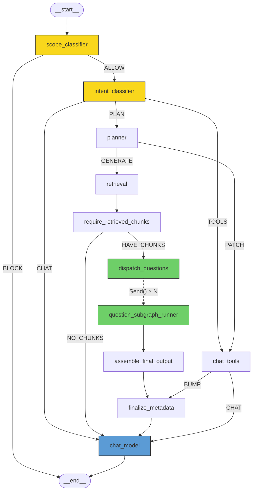
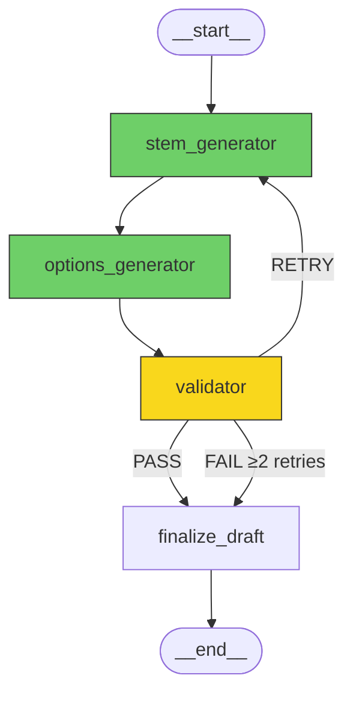

# Otis Documentation Plan

> **Status:** Plan execution in progress — core docs are now written (`README.md`, `ARCHITECTURE.md`, `BACKEND_REFERENCE.md`, `FRONTEND_REFERENCE.md`, `DATA_FLOW.md`, `API_CONTRACT.md`). `CONTRIBUTING.md` is now present.
> **Generated:** 2026-02-27
> **Audience:** First-time contributor with zero prior exposure to this codebase.

---

## Table of Contents

1. [Document Inventory](#1-document-inventory)
2. [README.md](#2-readmemd)
3. [ARCHITECTURE.md](#3-architecturemd)
4. [BACKEND_REFERENCE.md](#4-backend_referencemd)
5. [FRONTEND_REFERENCE.md](#5-frontend_referencemd)
6. [DATA_FLOW.md](#6-data_flowmd)
7. [API_CONTRACT.md](#7-api_contractmd)
8. [CONTRIBUTING.md](#8-contributingmd)
9. [Cross-Cutting Gaps & Blockers](#9-cross-cutting-gaps--blockers)

---

## 1. Document Inventory

| #   | Document           | Target Location                 | Estimated Sections | Primary Code References                                                |
| --- | ------------------ | ------------------------------- | ------------------ | ---------------------------------------------------------------------- |
| 1   | README             | `/README.md` (replaces current) | 10                 | docker-compose.yml, pyproject.toml, package.json, Dockerfile.api       |
| 2   | Architecture       | `/docs/ARCHITECTURE.md`         | 12                 | All infrastructure files, src/agents/chat_agent.py, src/api/v1/main.py |
| 3   | Backend Reference  | `/docs/BACKEND_REFERENCE.md`    | 14                 | Every `.py` file under `src/`                                          |
| 4   | Frontend Reference | `/docs/FRONTEND_REFERENCE.md`   | 11                 | Every `.tsx`/`.ts` file under `frontend/otis-ui/src/`                  |
| 5   | Data Flow          | `/docs/DATA_FLOW.md`            | 8                  | Agent graph, CRUD layer, services, SSE protocol                        |
| 6   | API Contract       | `/docs/API_CONTRACT.md`         | 10                 | All router files, schema.py, frontend api/ layer                       |
| 7   | Contribution Guide | `/CONTRIBUTING.md`              | 9                  | Build files, lint configs, docker-compose.yml                          |

---

## 2. README.md

**Purpose:** Single entry point. A new contributor reads this first and knows what the project is, how to run it, and where to look next.

### Sections

#### 2.1 Project Overview

- **Content:** One-paragraph description of Otis as an educational/assessment platform: document ingestion → concept extraction → MCQ generation → conversational AI tutoring.
- **Code refs:** None (domain knowledge).
- **Decisions to explain:** Why "Otis" exists, target users (educators, students), core value proposition.

#### 2.2 Tech Stack Summary

- **Content:** Table listing every major dependency and its role: FastAPI, LangGraph, RQ, Postgres+pgvector, Redis, Ollama, Azure OpenAI, React, Vite, TanStack Query, shadcn/ui, Tailwind 4.1.
- **Code refs:** `pyproject.toml`, `package.json`, `docker-compose.yml`.
- **Decisions to explain:** Azure OpenAI for LLM inference vs Ollama for local embeddings (cost/privacy hybrid).

#### 2.3 Monorepo Layout

- **Content:** Annotated directory tree. Mark dead/legacy files explicitly. Group into: Backend (root + `src/`), Frontend (`frontend/otis-ui/`), Infrastructure (`docker-compose.yml`, `Dockerfile.api`, `migrations/`), Scripts, Docs.
- **Code refs:** File system.
- **Decisions to explain:** No monorepo tool (Nx, Turborepo) — coordination via docker-compose only. Python backend at repo root (not `backend/` subfolder) because it was the original project.

#### 2.4 Prerequisites

- **Content:** Python 3.12, Node.js ≥18, Docker + Docker Compose, `uv` package manager, Ollama (if running outside Docker).
- **Code refs:** `pyproject.toml` (python version), `package.json` (engines, if any), `Dockerfile.api`.

#### 2.5 Environment Variables

- **Content:** Table of every env var with description, required/optional, default, which service reads it. Source: `.env`, `.env.fastapi`.
- **Code refs:** `src/core/config.py` (Pydantic `BaseSettings`), `docker-compose.yml` (env section), `src/agents/utils/llm_config.py`, `src/services/retrieval_service.py`, `.env.example`.
- **Decisions to explain:** Split `.env` / `.env.fastapi` pattern.
- **✅ RESOLVED:** `.env.example` now exists with all required vars (`AZURE_OPENAI_ENDPOINT`, `AZURE_OPENAI_API_KEY`, `LANGSMITH_*`, `DB_URL`, `JWT_SECRET_KEY`, `POSTGRES_*`, `PGADMIN_*`, `VITE_API_BASE_URL`). Documentation can reference it directly.

#### 2.6 Quick Start (Docker)

- **Content:** Step-by-step: clone → create `.env` files → `docker compose up` → access at localhost:5173 (frontend) / localhost:8000 (API) / localhost:5050 (pgAdmin).
- **Code refs:** `docker-compose.yml`.
- **Decisions to explain:** `--reload` flag in API container (dev mode, not production-ready).

#### 2.7 Quick Start (Local Dev)

- **Content:** Step-by-step for running API + frontend outside Docker. Python virtualenv via `uv`, `npm install`, running Postgres/Redis/Ollama locally.
- **Code refs:** `pyproject.toml`, `package.json`, `vite.config.ts`.
- **⚠ GAP:** No documented local-only setup. Must test which env vars are needed and whether Ollama URL needs to change from `http://ollama:11434` to `http://localhost:11434`.

#### 2.8 Database Setup

- **Content:** Postgres with pgvector extension. Running migrations in order. Backfill script.
- **Code refs:** `migrations/001_vectorstore_refactor.sql` through `add_dedup_lean.sql`, `scripts/backfill_file_hashes.py`.
- **Decisions to explain:** No Alembic — raw SQL files, manual ordering. Why (speed of iteration during prototyping).

#### 2.9 Running Tests

- **Content:** Current state (partial test coverage). Mention `tests/test_security_tokens.py` for backend and frontend Vitest coverage (`frontend/otis-ui/src/api/authApi.test.ts`). Note: integration/E2E coverage is still a priority.
- **Code refs:** `tests/`, `frontend/otis-ui/src/api/authApi.test.ts`.
- **⚠ GAP:** Test runners exist (`unittest` backend, `vitest` frontend) but coverage is still limited and not yet standardized in CI.

#### 2.10 LangGraph Agent Diagram

- **Content:** LangGraph-style mermaid diagram of the active chat agent graph (`chat_agent.py`) and the MCQ question subgraph (`mcq_subgraph.py`). This is the heart of the system and should be front-and-center in the README.
- **Code refs:** `src/agents/chat_agent.py`, `src/agents/mcq_subgraph.py`.
- **Format:** Two mermaid diagrams rendered directly in the README.
- **Main graph diagram (exact topology from code):**



- **MCQ question subgraph (per-question, invoked via `Send()`):**



- **Decisions to explain:** Fan-out via `Send()` for parallel per-question generation. Max 2 validation retries. Scope classifier as entry guardrail. Intent branching into chat/tools/plan paths.

#### 2.11 Where to Go Next

- **Content:** Signposts to Architecture, Backend Reference, Frontend Reference, Contributing Guide.

---

## 3. ARCHITECTURE.md

**Purpose:** System design overview. Answers "how does this all fit together?" for someone who will be making cross-cutting changes.

### Sections

#### 3.1 System Context Diagram

- **Content:** High-level box diagram: User → React SPA → FastAPI → {Postgres, Redis, Ollama, Azure OpenAI}. Show RQ worker as background process.
- **Code refs:** `docker-compose.yml`.
- **Format:** Mermaid diagram + prose explanation.

#### 3.2 Service Architecture

- **Content:** Describe each service from docker-compose: db, redis, api, worker, ollama, pgadmin. Note that no service mesh, API gateway, or load balancer exists. Agent service is commented out.
- **Code refs:** `docker-compose.yml`, `Dockerfile.api`.
- **Decisions to explain:** Agent runs in-process with API (not separately) — simplicity trade-off. RQ worker is a separate process but same Docker image.

#### 3.3 Backend Layer Diagram

- **Content:** Layered architecture: Routers → CRUD → ORM/Services → Database. Separate path: Routers → LangGraph Agent → Services → Database/LLM.
- **Code refs:** `src/api/routers/`, `src/api/crud/`, `src/api/__init__.py` (models), `src/services/`, `src/agents/`.
- **Decisions to explain:** Why CRUD layer exists between routers and ORM (separation of auth/business logic from HTTP concerns). Why services are separate from CRUD (reusable by both API and agent).

#### 3.4 Frontend Architecture

- **Content:** React SPA with React Router v6 (createBrowserRouter). State strategy: TanStack Query for server state, React context for auth, local useState for UI state. No global state store.
- **Code refs:** `main.tsx`, `authContext.tsx`, `src/hooks/`, `src/api/queryKeys.ts`.
- **Decisions to explain:** No Redux/Zustand — project is small enough for context + TanStack Query. shadcn/ui for full component control.

#### 3.5 Authentication & Authorization

- **Content:** JWT flow: login → token in localStorage → Authorization header on every request. `get_current_user` dependency extracts user. `verify_project_access` for project-scoped routes. Admin role bypass.
- **Code refs:** `src/core/security.py`, `src/api/routers/auth.py`, `frontend/otis-ui/src/authContext.tsx`, `frontend/otis-ui/src/api/authApi.ts`.
- **Decisions to explain:** No refresh token rotation (known gap). No server-side session store. Admin as simple role flag, not RBAC.

#### 3.6 Database Schema

- **Content:** ER diagram of all tables. Describe each table, its relationships, and pgvector columns.
- **Code refs:** `src/api/__init__.py` (ORM models), `migrations/`.
- **Format:** Mermaid ER diagram + table-by-table descriptions.
- **Decisions to explain:** Per-user vectorstores (not per-project). LangGraph checkpoint tables in same schema. Junction tables for project↔doc and project↔mcq.
- **⚠ GAP:** No formal migration changelog. Schema must be inferred from ORM + migration files, which may diverge.

#### 3.7 LangGraph Agent Architecture

- **Content:** Full graph topology diagram. Node descriptions, edge conditions, fan-out/fan-in for MCQ questions, interrupt semantics.
- **Code refs:** `src/agents/chat_agent.py`, `src/agents/mcq_subgraph.py`, `src/agents/nodes/`, `src/agents/utils/state.py`.
- **Decisions to explain:** Why LangGraph (state machine + checkpointing + streaming). Why per-question subgraphs (parallel generation + independent validation retries). Scope classifier as entry guardrail.
- **Format:** Mermaid state diagram.

#### 3.8 Embedding & RAG Pipeline

- **Content:** Document ingestion flow (upload → hash → Docling parse → markdown split → concept extraction → PGVector storage). Retrieval flow (concept matching → chunk retrieval → context assembly).
- **Code refs:** `src/tasks/embedding_tasks.py`, `src/services/concept_service.py`, `src/services/retrieval_service.py`.
- **Decisions to explain:** Two-layer concept-aware retrieval. Content-hash dedup. Docling over simpler parsers (handles complex PDF layouts). IVFFlat indexing.

#### 3.9 Background Task System

- **Content:** RQ architecture: single worker, single queue, Redis broker. Task registration, failure handling, status reporting.
- **Code refs:** `src/tasks/embedding_tasks.py`, `src/api/crud/embeddings.py`, `docker-compose.yml` (worker service), `src/worker.py`.
- **Decisions to explain:** RQ over Celery (simplicity for single-worker scenario).

#### 3.10 SSE Streaming Protocol

- **Content:** Two separate SSE protocols: chat invoke (newline-delimited JSON) and agent graph (`data:` prefix). Event types, payloads, lifecycle.
- **Code refs:** `src/api/routers/chat.py` (invoke endpoint), `src/api/routers/agent.py`, `src/api/constants.py`, `src/api/utils/__init__.py` (TokenChunkBuffer, EventSequencer), `frontend/otis-ui/src/api/chatApi.ts`, `frontend/otis-ui/src/api/agentApi.ts`.
- **Decisions to explain:** Event sourcing in `chat_message_events` for reliable replay. Monotonic sequence numbers. TokenChunkBuffer for batching small tokens.

#### 3.11 Deployment Model

- **Content:** Docker Compose as the deployment mechanism. No CI/CD pipeline documented. No production hardening (non-root user, multi-stage builds, secrets management).
- **Code refs:** `docker-compose.yml`, `Dockerfile.api`.
- **Decisions to explain:** Dev-first deployment — `--reload`, `echo=True`, hardcoded credentials are all dev conveniences not yet production-hardened.
- **⚠ GAP:** No production deployment documentation or configuration exists.

#### 3.12 Known Architectural Limitations

- **Content:** Consolidated list: no migration framework, no shared types between frontend/backend, no test infrastructure, single-worker embedding pipeline, no rate limiting, no error boundaries in frontend.
- **Code refs:** Tech debt table from user context (items #11-38).
- **Decisions to explain:** These are conscious trade-offs for iteration speed during prototyping phase.

---

## 4. BACKEND_REFERENCE.md

**Purpose:** Encyclopedic reference for every Python module. A contributor can look up any function signature, understand its behavior, and know its failure modes.

### Sections

#### 4.1 Module Map

- **Content:** Visual tree of all Python modules grouped by layer: Core, API (routers, CRUD, utilities, schemas, models), Services, Tasks, Agents (graph builders, nodes, prompts, utilities). Mark deprecated/dead modules.
- **Code refs:** Full `src/` tree.

#### 4.2 Core (`src/core/`)

- **Content:** Function-by-function reference for:
  - `config.py` — `Settings` class, all fields, env var mapping, `get_settings()` singleton.
  - `hashing.py` — `compute_file_hash(file) → str`, `compute_content_hash(text) → str`. Failure: returns hash of empty string on I/O error.
  - `security.py` — `hash_password()`, `verify_password()`, `create_access_token()`, `get_current_user()`, `verify_project_access()`. Failure: raises `HTTPException(401)` / `HTTPException(403)`.
- **Code refs:** `src/core/config.py`, `src/core/hashing.py`, `src/core/security.py`.

#### 4.3 ORM Models (`src/api/__init__.py`)

- **Content:** Every model class, its columns, relationships, and constraints. Table showing mapped table name → class → columns → FKs → indexes.
- **Code refs:** `src/api/__init__.py` (532 lines).
- **Decisions to explain:** Dual model definitions (root `models.py` is dead, `src/api/__init__.py` is canonical). LangGraph tables in app schema.

#### 4.4 Pydantic Schemas (`src/api/db/schema.py`)

- **Content:** Every request/response schema: fields, types, validators, defaults. Grouped by domain: Auth, Chat, Documents, MCQ, Agent, Embeddings.
- **Code refs:** `src/api/db/schema.py`.

#### 4.5 Routers (`src/api/routers/`)

- **Content:** Per-router reference:
  - **auth.py** — 7 endpoints (3 implemented, 4 stubs). Auth dependencies on each.
  - **chat.py** — 12 endpoints. SSE streaming on invoke. Event replay logic.
  - **docs.py** — 10 endpoints across two routers (project-scoped + user-scoped).
  - **projects.py** — 4 endpoints.
  - **embeddings.py** — 3 endpoints.
  - **mcqs.py** — 3 endpoints. Note: no auth.
  - **agent.py** — 2 endpoints. Human-in-the-loop interrupt.
- **Code refs:** `src/api/routers/*.py`.
- **For each endpoint:** Method, path, auth requirement, request schema, response schema, status code, error responses, side effects.
- **⚠ GAP:** Auth stubs (logout, refresh, delete, edit) have no implementation to document. Must document as "stub — returns empty string."

#### 4.6 CRUD Layer (`src/api/crud/`)

- **Content:** Per-module function reference:
  - **chat.py** (699 lines) — 20+ functions. Crash recovery. Event sequencing. Aggregate sync.
  - **docs.py** (553 lines) — File-hash dedup logic. Staging directory pattern. Orphaned embedding tech debt.
  - **users.py** — Registration, login. Password hashing via security module.
  - **projects.py** — CRUD with admin bypass.
  - **embeddings.py** — Vectorstore lifecycle. RQ job enqueueing. Status reporting.
  - **mcq.py** — CRUD with hardcoded IST timezone.
- **Code refs:** `src/api/crud/*.py`.
- **For each function:** Signature, parameters, return type, database operations performed, exceptions raised, side effects.

#### 4.7 API Utilities (`src/api/utils/`)

- **Content:** `TokenChunkBuffer` (accumulation + flush logic, configurable thresholds), `EventSequencer` (monotonic counter), `constants.py` (event type strings).
- **Code refs:** `src/api/utils/__init__.py`, `src/api/constants.py`.

#### 4.8 Database Session (`src/api/db/session.py`)

- **Content:** `engine`, `async_session_maker`. Connection URL handling. `echo=True` note.
- **Code refs:** `src/api/db/session.py`.

#### 4.9 Services (`src/services/`)

- **Content:** Per-service reference:
  - **embedding_service.py** — LEGACY. Document as deprecated, superseded by `embedding_tasks.py`.
  - **concept_service.py** — `extract_concepts()`, `classify_chunks_to_concepts()`, `store_concepts()`. LLM model, prompt, structured output format. Failure: falls back to "general" tag.
  - **retrieval_service.py** — `retrieve_with_concepts()`, `format_retrieved_context()`. Two-layer retrieval algorithm explained step by step. SQL queries documented.
  - **file_handling.py** — File I/O functions. Streaming hash. Zip (memory warning). Thumbnail generation.
- **Code refs:** `src/services/*.py`.

#### 4.10 Background Tasks (`src/tasks/`)

- **Content:** `embedding_tasks.py` — `process_embeddings(user_id, doc_ids)`. Full pipeline: Docling parse → content-hash dedup → concept extraction → markdown split → PGVector add → concept embedding storage. Failure modes at each stage. Function attribute `_concept_buffer` anti-pattern documented.
- **Code refs:** `src/tasks/embedding_tasks.py`, `src/worker.py`.

#### 4.11 Agent Graph Builders (`src/agents/`)

- **Content:**
  - **chat_agent.py** — `build_chat_graph()` topology, node registration, edge conditions, compiled graph. Module-level compilation.
  - **mcq_subgraph.py** — Per-question subgraph: stem → options → validator → retry loop. `Send()` fan-out.
  - **graph.py** — DEPRECATED. Document as legacy, reference only.
- **Code refs:** `src/agents/chat_agent.py`, `src/agents/mcq_subgraph.py`, `src/agents/graph.py`.

#### 4.12 Agent Nodes (`src/agents/nodes/`)

- **Content:** Per-node function reference:
  - **scope.py** — `scope_classifier_node()`. ALLOW/BLOCK classification. Prompt, model, structured output.
  - **intent.py** — `intent_classifier_node()`. 4 intent types. SSE event emission.
  - **planner.py** — `planner_node()`. TestGenerationPlan output. Edit expansion.
  - **retrieval.py** — `retrieval_node()`. PGVector query. Exception handling.
  - **chat.py** — `chat_no_tools_node()`, `chat_with_tools_node()` (STUB).
  - **output.py** — `assemble_final_mcqs_node()`, `finalize_metadata_node()`.
  - **validator.py** — `validator_node()`. Validation criteria. Retry logic.
  - **generation/stem.py** — `stem_generator_node()`. Raw text output.
  - **generation/options.py** — `options_generator_node()`. Structured output.
  - **generation/finalize.py** — DEAD CODE.
- **Code refs:** `src/agents/nodes/*.py`, `src/agents/nodes/generation/*.py`.
- **For each node:** Input state slice consumed, output state updates, LLM model used, prompt template referenced, failure behavior.

#### 4.13 Agent State & Schemas (`src/agents/utils/state.py`, `src/agents/nodes/schemas.py`)

- **Content:** Every TypedDict and Pydantic model. Field descriptions, reducers (`add` for `messages`, `mcq_drafts`). Relationship between `State`, `QuestionSubgraphState`, and `AgentState` (legacy).
- **Code refs:** `src/agents/utils/state.py`, `src/agents/nodes/schemas.py`.

#### 4.14 Agent Prompts (`src/agents/prompts/`)

- **Content:** Every prompt template: name, registry key, template variables, example invocations. Prompt engineering rationale where inferable.
- **Code refs:** `src/agents/prompts/chat.py`, `classification.py`, `generation.py`, `planner.py`, `validator.py`.
- **Decisions to explain:** Prompt registry pattern (centralized dict decoupling prompts from nodes).

---

## 5. FRONTEND_REFERENCE.md

**Purpose:** Component-by-component reference. A contributor can find any UI element, understand its props/state/data dependencies, and know where to make changes.

### Sections

#### 5.1 Project Structure

- **Content:** Annotated directory tree of `frontend/otis-ui/src/`. Grouping: pages, features, layouts, shared UI, hooks, API layer.
- **Code refs:** File system.

#### 5.2 Routing & Navigation

- **Content:** Route table (path → component → auth required → status). Commented-out routes. `RequireAuth` guard logic.
- **Code refs:** `main.tsx`, `authContext.tsx` (`RequireAuth`).

#### 5.3 State Management Patterns

- **Content:** Three patterns documented:
  1. **Server state:** TanStack Query (`useQuery`, `useMutation`) with `queryKeys.ts` factory.
  2. **Auth state:** React context (`AuthProvider`, `useAuth()`).
  3. **Local UI state:** `useState` in page components.
  4. **Session storage:** Vectorstore sync state in `sessionStorage`.
- **Code refs:** `authContext.tsx`, `src/api/queryKeys.ts`, `src/hooks/*.ts`, page components.
- **Decisions to explain:** No Redux/Zustand. Inconsistency between TanStack Query and raw `useEffect` fetch (tech debt, not intentional pattern).

#### 5.4 API Layer (`src/api/`)

- **Content:** Per-file reference:
  - **authApi.ts** — Axios instance, `login()`, `register()`, `me()`. Hardcoded base URL.
  - **chatApi.ts** (479 lines) — Full chat CRUD + SSE streaming. `stream()` implementation: native fetch, ReadableStream reader, manual line parsing. Abort controller.
  - **docApi.ts** — User-level and project-scoped document operations.
  - **embeddingsApi.ts** — Sync, status, clear.
  - **agentApi.ts** (230 lines) — Agent graph start/resume with SSE. Different event protocol.
  - **mcqApi.ts** — MCQ operations. URL fallback pattern.
  - **projectApi.ts** — Project CRUD.
  - **queryKeys.ts** — TanStack Query key factory (documents, chats, messages, attachments).
- **Code refs:** `src/api/*.ts`.
- **For each function:** Parameters, return type, HTTP method/path called, error handling behavior.

#### 5.5 Custom Hooks (`src/hooks/`)

- **Content:** Per-hook reference:
  - **useDocuments()** — TanStack Query wrapper for document list.
  - **useUploadDocument()** — Upload mutation with optimistic update.
  - **useDeleteDocuments()** — Batch delete mutation.
  - **useDocumentSelection()** — Checkbox state management.
  - **useThumbnail(docId)** — Thumbnail fetch + in-memory cache. Memory leak risk documented.
  - **useAgentStream()** — Agent SSE streaming state machine (`AgentPhase` enum).
  - **useIsMobile()** — Responsive breakpoint detection.
- **Code refs:** `src/hooks/*.ts`.

#### 5.6 Pages (`src/pages/`)

- **Content:** Per-page reference:
  - **chat-page.tsx** (660 lines) — Dual-panel layout. SSE streaming with event buffering. Mention-based document attachment. Thinking step display. State: all `useState` + direct API calls. **Key complexity: SSE lifecycle management, abort handling, event replay for page refresh.**
  - **data-library.tsx** (479 lines) — Document management. Grid/list view toggle. TanStack Query.
  - **vector-store-page.tsx** — Sync UI. `sessionStorage` + `useEffect` pattern.
  - **projects.tsx** — Project list. `useEffect` fetch (not TanStack Query).
  - **project-detail.tsx** — Tabs: documents + MCQs. Mixed data fetching.
  - **dashboard.tsx** — Hardcoded demo data.
  - **login.tsx / signup.tsx** — Zod-validated forms. Non-functional Google button.
  - **Placeholder pages** — `word-assistant`, `help`, `search`, `settings`, `reports` — all "Coming soon".
- **Code refs:** `src/pages/*.tsx`.

#### 5.7 Feature Components

- **Content:** Per-feature-group reference:
  - **chat/** — `ChatMessageBubble`, `ChatConversationList`, `ChatThinkingSteps`. Props, rendering logic.
  - **mention/** (~2,500 lines, 11 files) — `MentionPickerProvider`, `useMentionPicker` (681-line state machine), `MentionPopover`, `MentionChip`, `MentionTextarea`. Trigger: `@` key. Well-architected.
  - **documents/** — `DocumentsTab` (778 lines — duplicates DataLibrary), `DocumentPreview`, `ThumbnailImage`, `ScrollingFileName`, `document-grid`.
  - **generation/** — `ConceptSelector`, `GenerateTab`, `ReviewTab`.
  - **projects/** — `ProjectDetailPage`, `ProjectDetail`, `CreateProjectDialog`.
  - **dashboard/** — `chart-area-interactive` (Recharts), `SectionCards`, `DataCard`.
  - **auth/** — `LoginForm`, `SignupForm`, `RequireAuth`.
  - **embeddings/** — `columns`, `embeddings-table`.
- **Code refs:** `src/components/features/*/`.
- **For each component:** Props interface, internal state, data dependencies (API calls or context), child components.

#### 5.8 Layout Components (`src/components/layouts/`)

- **Content:** `AppSidebar`, `NavDocuments`, `NavMain`, `NavSecondary`, `NavUser`, `SiteHeader`, `ThemeProvider`. Sidebar structure, navigation item definitions, recent chats fetch.
- **Code refs:** `src/components/layouts/*.tsx`.

#### 5.9 AI Element Components (`src/components/ai-elements/`)

- **Content:** `PromptInput` (1,342 lines) — `PromptInputProvider` context, sub-components, attachment handling, mention integration, streaming status display. `ChainOfThought` — thinking step visualization. `Conversation` — message list with scroll management. `InlineCitation` — source attribution cards.
- **Code refs:** `src/components/ai-elements/*.tsx`.

#### 5.10 Shared & UI Components

- **Content:** 42 shadcn/ui primitives (list with customization notes). Custom overrides: `data-table.tsx` (hardcoded to EmbeddingVersion), `alert-dialog.tsx` (hardcoded delete-account text).
- **Code refs:** `src/components/ui/`, `src/components/shared/`.

#### 5.11 Styling & Theming

- **Content:** Tailwind 4.1 setup. oklch color tokens. Dark/light mode via `next-themes` ThemeProvider. `App.css` / `index.css` structure.
- **Code refs:** `vite.config.ts`, `index.css`, `App.css`, `components.json`.
- **⚠ GAP:** `"use client"` directives in 5+ files are Next.js artifacts (noop in Vite). Should be documented as dead code.

---

## 6. DATA_FLOW.md

**Purpose:** End-to-end request lifecycle documentation. A contributor can trace any user action from click to database write and back.

### Sections

#### 6.1 Authentication Flow

- **Content:** Sequence diagram: Signup/Login → JWT creation → localStorage → Authorization header → `get_current_user` extraction → user object in route handlers.
- **Code refs:** `authContext.tsx`, `authApi.ts`, `src/api/routers/auth.py`, `src/api/crud/users.py`, `src/core/security.py`.
- **Format:** Mermaid sequence diagram.

#### 6.2 Document Upload & Processing Pipeline

- **Content:** Full lifecycle: File selection → multipart upload → file-hash dedup check → staged file write → DB record creation → (later) vectorstore sync trigger → RQ job → Docling parse → content-hash dedup → concept extraction → markdown splitting → PGVector embedding storage → status update.
- **Code refs:** `src/api/routers/docs.py`, `src/api/crud/docs.py`, `src/services/file_handling.py`, `src/core/hashing.py`, `src/api/routers/embeddings.py`, `src/api/crud/embeddings.py`, `src/tasks/embedding_tasks.py`, `src/services/concept_service.py`.
- **Format:** Mermaid sequence diagram + stage-by-stage prose.
- **Decisions to explain:** Two-phase design (upload is instant, embedding is async). Content-hash dedup as second layer. Concept extraction as embedding-time enrichment.

#### 6.3 RAG Retrieval Pipeline

- **Content:** Two-layer retrieval algorithm:
  1. **Layer 1 — Concept matching:** User query → concept embedding → cosine similarity against `document_concepts` → candidate document IDs.
  2. **Layer 2 — Chunk retrieval:** PGVector similarity search filtered to candidate documents → deduplication → ranked chunks.
  3. **Context assembly:** `format_retrieved_context()` → prompt injection.
- **Code refs:** `src/services/retrieval_service.py`, `src/agents/nodes/retrieval.py`, `src/agents/utils/helpers.py`.
- **Format:** Flowchart + SQL queries annotated.
- **Decisions to explain:** Why two layers (precision over recall). IVFFlat tradeoffs.

#### 6.4 Chat Invoke Lifecycle (SSE Streaming)

- **Content:** End-to-end sequence:
  1. Frontend: user types message → POST `/{chat_id}/invoke` with `ChatInvokeRequest`.
  2. Backend: create assistant message (status=IN_PROGRESS) → invoke LangGraph → stream events via `StreamingResponse`.
  3. Event flow: `started` → `token`/`reasoning_token`/`thinking` (repeated) → `done`/`error`.
  4. Backend persistence: each event → `chat_message_events` table with monotonic sequence.
  5. Frontend parsing: `chatApi.stream()` → ReadableStream reader → line-by-line JSON parse → UI state updates.
  6. Completion: `done` event → update message content + status → sync chat aggregates.
  7. Crash recovery: `mark_stale_messages_failed()` on server restart.
  8. Event replay: GET `/{chat_id}/messages/{message_id}/events` → JSON (completed) or live-tail SSE (in-progress).
- **Code refs:** `src/api/routers/chat.py` (invoke endpoint, ~200 lines), `src/api/crud/chat.py`, `src/api/utils/__init__.py`, `src/api/constants.py`, `frontend/otis-ui/src/api/chatApi.ts`, `frontend/otis-ui/src/pages/chat-page.tsx`.
- **Format:** Mermaid sequence diagram + event protocol table.
- **Decisions to explain:** Event sourcing for reliability. TokenChunkBuffer for batching. Monotonic sequence for ordering. Polling-based live-tail (500ms).

#### 6.5 Agent Graph Decision Tree

- **Content:** Full decision tree from user message to final response:
  ```
  User message
  → scope_classifier: ALLOW / BLOCK
    → BLOCK: return refusal message
    → ALLOW → intent_classifier: mcq_request / followup / utility_task / clarification
      → followup / utility_task / clarification → chat_no_tools_node → response
      → mcq_request → planner_node → retrieval_node
        → fan-out: Send() per question
          → per question: stem_generator → options_generator → validator
            → validation_passed → finalize_draft
            → validation_failed (retry < 2) → stem_generator (retry)
            → validation_failed (retry >= 2) → finalize_draft (best effort)
        → fan-in: assemble_final_mcqs → finalize_metadata → chat_no_tools_node → response
  ```
- **Code refs:** `src/agents/chat_agent.py`, all node files, `src/agents/utils/state.py`.
- **Format:** Mermaid flowchart (detailed) + decision table.
- **Decisions to explain:** Fan-out/fan-in for parallel question generation. Max 2 retries. Validator criteria. Scope classifier as safety guardrail.

#### 6.6 Legacy Agent Graph (MCQ-only)

- **Content:** Deprecated graph topology: `fetch_documents → generate_summaries → human_approval → generate_search_queries → retrieve_context`. Human-in-the-loop via LangGraph `interrupt()`.
- **Code refs:** `src/agents/graph.py`, `src/api/routers/agent.py`.
- **Document as:** Legacy — preserved for reference, not for active development.

#### 6.7 Background Embedding Task Flow

- **Content:** RQ task lifecycle: job enqueue → worker picks up → Docling PDF→markdown → content-hash check → concept extraction → chunk splitting → PGVector batch insert → status update.
- **Code refs:** `src/tasks/embedding_tasks.py`, `src/worker.py`, `src/api/crud/embeddings.py`.
- **Format:** Flowchart with failure points annotated.
- **Decisions to explain:** Why RQ (not Celery). Single worker limitation. Function attribute anti-pattern.

#### 6.8 MCQ Generation End-to-End

- **Content:** User requests MCQs → intent classified → plan generated → chunks retrieved → questions generated in parallel → validated → assembled → returned in chat response + persisted.
- **Code refs:** Cross-references from 6.5, plus `src/api/crud/mcq.py` for persistence.
- **Format:** Annotated walkthrough with state snapshots at each node.

---

## 7. API_CONTRACT.md

**Purpose:** Complete API reference. A frontend developer can implement against this without reading backend code.

### Sections

#### 7.1 Base URL & Authentication

- **Content:** Base URL: `http://localhost:8000/v1`. Auth: Bearer token in `Authorization` header. Token obtained via `/v1/auth/login`. Token format: JWT with `user_id` claim.
- **Code refs:** `src/api/v1/main.py`, `src/core/security.py`.

#### 7.2 Authentication Endpoints (`/v1/auth/`)

- **Content:** Full spec for: `POST /register`, `POST /login`, `GET /me`. Stubs noted for: `POST /logout`, `POST /refresh`, `DELETE /delete`, `PUT /edit`.
- **Code refs:** `src/api/routers/auth.py`, `src/api/db/schema.py` (CreateUser, LoginUser, AuthResponse, Token).
- **For each:** Request body schema, response schema, status codes (200, 201, 401, 409), error body format.

#### 7.3 Chat Endpoints (`/v1/chats/`)

- **Content:** 12 endpoints fully specified. Special attention to:
  - `POST /{chat_id}/invoke` — SSE streaming response. Event protocol table. Abort behavior.
  - `GET /{chat_id}/messages/{message_id}/events` — Conditional response: JSON for completed messages, SSE for in-progress.
- **Code refs:** `src/api/routers/chat.py`, `src/api/db/schema.py` (ChatCreate, ChatUpdate, ChatResponse, ChatMessageCreate, ChatMessageUpdate, ChatMessageResponse, ChatInvokeRequest, ChatMessageEventResponse).
- **Format:** OpenAPI-style tables per endpoint.

#### 7.4 Document Endpoints (`/v1/documents/` & `/v1/project/{project_id}/documents/`)

- **Content:** 10 endpoints across two routers. File upload (multipart/form-data). Thumbnail response (image/png). Download (file/zip). Dedup behavior documented.
- **Code refs:** `src/api/routers/docs.py`, `src/api/db/schema.py` (DocBase, DocResponse, DocDelete, DocLinkRequest).

#### 7.5 Project Endpoints (`/v1/projects/`)

- **Content:** 4 endpoints. Admin bypass behavior.
- **Code refs:** `src/api/routers/projects.py`, `src/api/db/schema.py`.

#### 7.6 Embedding Endpoints (`/v1/embeddings/`)

- **Content:** 3 endpoints. Async job semantics: sync returns immediately, use status to poll.
- **Code refs:** `src/api/routers/embeddings.py`, `src/api/db/schema.py` (VectorstoreStatus, VectorstoreSyncRequest).

#### 7.7 MCQ Endpoints (`/v1/mcqs/`)

- **Content:** 3 endpoints. **Note: no authentication required (known gap).**
- **Code refs:** `src/api/routers/mcqs.py`, `src/api/db/schema.py` (CreateMCQ, ReadMCQ).

#### 7.8 Agent/Graph Endpoints (`/v1/graph/`)

- **Content:** 2 endpoints. SSE protocol (different from chat). Human-in-the-loop resume semantics.
- **Code refs:** `src/api/routers/agent.py`, `src/api/db/schema.py` (StartGraphRequest, ResumeRequest).
- **⚠ GAP:** Agent SSE event types are not formally defined in schema.py. Must reverse-engineer from agentApi.ts and router code.

#### 7.9 SSE Event Protocols

- **Content:** Two protocol specifications side by side:
  - **Chat protocol:** Newline-delimited JSON. Event types: `started`, `token`, `reasoning_token`, `thinking`, `done`, `error`. Payload schemas for each.
  - **Agent protocol:** `data:` prefix lines. Event types: `guardrail_result`, `search_queries`, `retrieval_complete`, `human_review`, `mcq_generated`, `error`, `complete`. Payload schemas for each.
- **Code refs:** `src/api/constants.py`, `src/api/routers/chat.py`, `src/api/routers/agent.py`.
- **⚠ GAP:** No formal schema definition for SSE payloads. Must extract from inline dict constructions in router code.

#### 7.10 Error Response Format

- **Content:** Standard error shape: `{ "detail": string }` (FastAPI default). Status code semantics: 400 (validation), 401 (auth), 403 (access), 404 (not found), 409 (conflict), 500 (server error).
- **Code refs:** All routers (HTTPException usage).
- **⚠ GAP:** No consistent error envelope. Some endpoints raise raw HTTPException, others return dict. Error codes are not enumerated in a central location.

---

## 8. CONTRIBUTING.md

**Purpose:** A new contributor can go from clone to merged PR with this guide.

### Sections

#### 8.1 Getting Started

- **Content:** Fork/clone instructions. Branch naming convention. Review the README first.
- **⚠ GAP:** No branch naming convention exists. Must propose one (e.g., `feat/`, `fix/`, `docs/`).

#### 8.2 Development Environment Setup

- **Content:** Two paths:
  1. **Docker (recommended):** `docker compose up` and you're running.
  2. **Local:** Python 3.12 via `uv`, Node.js ≥18, Postgres 17 with pgvector, Redis, Ollama.
- **Code refs:** `docker-compose.yml`, `pyproject.toml`, `package.json`.

#### 8.3 Backend Development

- **Content:** `uv` for dependency management. Virtual environment activation. Running the API: `uvicorn src.api.v1.main:app --reload --host 0.0.0.0 --port 8000`. Running the worker: `rq worker --with-scheduler`. Adding a new dependency: `uv add <package>`.
- **Code refs:** `pyproject.toml`.
- **⚠ GAP:** No linter/formatter configured (no ruff, black, or isort in pyproject.toml). Must propose a standard.

#### 8.4 Frontend Development

- **Content:** `npm install` → `npm run dev`. Build: `npm run build`. Adding a component: `npx shadcn-ui@latest add <name>`.
- **Code refs:** `package.json`, `vite.config.ts`, `tsconfig.json`, `eslint.config.js`, `components.json`.

#### 8.5 Code Conventions

- **Content:**
  - **Backend:** Async functions for all DB operations. Pydantic schemas for all request/response bodies. CRUD layer handles auth checks, routers are thin. Services for reusable business logic.
  - **Frontend:** TanStack Query for all server state (goal — some pages still use `useEffect`). Custom hooks for reusable data logic. shadcn/ui for all UI primitives.
- **Code refs:** Examples from existing code.
- **⚠ GAP:** No formal style guide, ESLint is configured but no Prettier. No Python linter config. Conventions must be inferred from best examples in the codebase and proposed.

#### 8.6 How to Add a Feature (End-to-End Walkthrough)

- **Content:** Walkthrough of adding a hypothetical feature touching both frontend and backend:
  1. Define Pydantic schema in `schema.py`.
  2. Add ORM model in `src/api/__init__.py`.
  3. Write migration SQL in `migrations/`.
  4. Implement CRUD functions in `src/api/crud/`.
  5. Add router in `src/api/routers/` and mount in `main.py`.
  6. Add API function in `frontend/otis-ui/src/api/`.
  7. Add TanStack Query hook if applicable.
  8. Build page/component in `frontend/otis-ui/src/`.
  9. Add route in `main.tsx`.
- **Code refs:** All layers referenced.
- **Decisions to explain:** No codegen — manual mirroring of types between Python and TypeScript.

#### 8.7 Database Changes

- **Content:** How to add a migration: create numbered SQL file, apply manually, update ORM model. Backfill scripts if needed.
- **Code refs:** `migrations/`, `scripts/`.
- **⚠ GAP:** No rollback procedure. Migrations are forward-only. Must document this limitation.

#### 8.8 Agent/Graph Changes

- **Content:** How to add a new node: define function, add to graph builder, update state if needed, add prompt to registry. How to modify the graph topology.
- **Code refs:** `src/agents/chat_agent.py`, `src/agents/nodes/`, `src/agents/prompts/`, `src/agents/utils/state.py`.

#### 8.9 Pull Request Checklist

- **Content:** Proposed checklist:
  - [ ] ORM model and migration aligned
  - [ ] Pydantic schema covers request/response
  - [ ] CRUD function has auth checks
  - [ ] Router is thin (delegates to CRUD)
  - [ ] Frontend type mirrors backend schema
  - [ ] TanStack Query used for server state
  - [ ] No hardcoded URLs or credentials
  - [ ] Manual test performed (no automated tests yet)
- **⚠ GAP:** No CI/CD pipeline. No automated checks. Checklist is manual.

---

## 9. Cross-Cutting Gaps & Blockers

These gaps will make specific sections **impossible to document accurately** without additional investigation or codebase changes.

### Hard Blockers (sections cannot be written without resolution)

| #     | Gap                                                                                                                                                          | Affected Sections                  | Resolution                                                                                                  |
| ----- | ------------------------------------------------------------------------------------------------------------------------------------------------------------ | ---------------------------------- | ----------------------------------------------------------------------------------------------------------- |
| ~~1~~ | ~~**No `.env.example` file**~~                                                                                                                               | ~~README §2.5, Contributing §8.2~~ | **RESOLVED** — `.env.example` created with 16 vars covering Azure, LangSmith, DB, auth, and frontend.       |
| 2     | **Agent SSE event types have no formal schema** — event payloads are constructed inline as dicts in `agent.py` router.                                       | API Contract §7.8, §7.9            | Must read router code line-by-line and frontend `agentApi.ts` to reconstruct the contract. High drift risk. |
| 3     | **Root `models.py` diverges from `src/api/__init__.py`** — dual model definitions with different column names (`user_name` vs `uname`) and inheritance bugs. | Backend Reference §4.3             | Document canonical source (`__init__.py`) and flag `models.py` as dead. Recommend deletion.                 |

### Soft Blockers (sections can be written but will contain caveats)

| #   | Gap                                                                                                                                | Affected Sections                     | Workaround                                                                                               |
| --- | ---------------------------------------------------------------------------------------------------------------------------------- | ------------------------------------- | -------------------------------------------------------------------------------------------------------- |
| 4   | **No test suite** — cannot document testing conventions, test patterns, or coverage expectations.                                  | README §2.9, Contributing §8.9        | Document current state honestly. Propose test infrastructure plan as future work.                        |
| 5   | **No CI/CD pipeline** — cannot document automated checks or deployment process.                                                    | Architecture §3.11, Contributing §8.9 | Document manual deployment via docker-compose. Propose CI/CD as future work.                             |
| 6   | **No linter/formatter config for Python** — cannot document code style enforcement.                                                | Contributing §8.5                     | Propose ruff config. Document as "to be adopted."                                                        |
| 7   | **Inconsistent data fetching patterns in frontend** — some pages use TanStack Query, others use raw `useEffect`.                   | Frontend Reference §5.3, §5.6         | Document both patterns. Mark `useEffect` fetch as tech debt to be migrated.                              |
| 8   | **Dead code throughout** — root-level files, deprecated graph, legacy routers, placeholder pages.                                  | All reference docs                    | Explicitly mark dead/deprecated items in every reference section. Recommend cleanup sprint.              |
| 9   | **No production deployment documentation** — only docker-compose for dev.                                                          | Architecture §3.11                    | Document dev deployment only. Note production gaps (secrets, non-root user, multi-stage builds).         |
| 10  | **`session.py` hardcodes DB URL** instead of using `config.py` settings — unclear which is the runtime source of truth.            | Backend Reference §4.8                | Must test at runtime to determine which URL is actually used. Document the discrepancy.                  |
| 11  | **Error response format is inconsistent** — no standard error envelope across endpoints.                                           | API Contract §7.10                    | Document FastAPI default `{"detail": ...}` and note endpoints that deviate.                              |
| 12  | **No OpenAPI spec exported** — FastAPI auto-generates one at `/docs`, but it may differ from actual behavior due to SSE endpoints. | API Contract (all)                    | Use FastAPI's auto-generated spec as starting point, then manually annotate SSE and streaming endpoints. |

---

## Execution Order

Recommended writing sequence (dependencies flow downward):

```text
1. README.md                    ← foundational, unblocks everything (Gap #1 resolved ✅)
   │
2. ARCHITECTURE.md              ← provides mental model for all references
   │
3. API_CONTRACT.md              ← needed by frontend reference
   ├── requires: agent SSE schema extraction (Gap #2)
   │
4. BACKEND_REFERENCE.md         ← largest document, independent of frontend
   │
5. DATA_FLOW.md                 ← references architecture + backend
   │
6. FRONTEND_REFERENCE.md        ← references API contract
   │
7. CONTRIBUTING.md              ← references all of the above
```

**Estimated total effort:** ~40–60 pages across all documents, depending on depth of code examples and diagrams.
