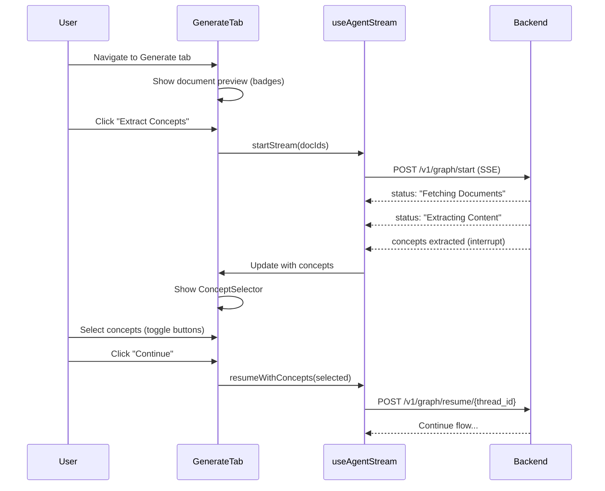

# Agent SSE Frontend with HITL Concept Selection

Build the frontend UI for the MCQ generation agent with SSE streaming and human-in-the-loop concept selection.

## Overview

The user flow is:

1. **Documents Tab**: User selects documents for MCQ generation
2. **Generate Tab**:
   - Show preview of selected documents (badges)
   - Start the agent SSE stream
   - Display real-time status updates
   - Show extracted concepts as selectable buttons (HITL)
   - User selects concepts to continue the flow

## Proposed Changes

### API Layer

#### [NEW] [agentApi.ts](file:///home/krishna/projects/otis/frontend/otis-ui/src/api/agentApi.ts)

Create API client for the agent/graph endpoints:

- `startGraph(docIds: string[])`: Initiates SSE stream at `/v1/graph/start`
- `resumeGraph(threadId: string, selectedConcepts: Concept[])`: Resumes at `/v1/graph/resume/{thread_id}`
- Type definitions for `Concept`, `AgentEvent`, etc.

---

### Hooks

#### [NEW] [useAgentStream.ts](file:///home/krishna/projects/otis/frontend/otis-ui/src/hooks/useAgentStream.ts)

Custom hook to manage SSE connection and state:

```typescript
interface UseAgentStreamReturn {
  status: string;
  concepts: Concept[];
  isLoading: boolean;
  threadId: string | null;
  error: string | null;
  startStream: (docIds: string[]) => void;
  resumeWithConcepts: (selectedConcepts: Concept[]) => void;
}
```

Features:

- Manages EventSource connection lifecycle
- Parses SSE events (status updates, concept extraction)
- Stores `thread_id` from response header for resume
- Handles interrupt state when concepts are ready for selection

---

### Components

#### [NEW] [DocumentPreview.tsx](file:///home/krishna/projects/otis/frontend/otis-ui/src/components/DocumentPreview.tsx)

Displays selected documents as badges:

```tsx
interface DocumentPreviewProps {
  documents: Document[];
}
```

- Uses existing `Badge` component
- Displays document filenames in badges
- Compact, horizontal layout with wrapping

---

#### [NEW] [ConceptSelector.tsx](file:///home/krishna/projects/otis/frontend/otis-ui/src/components/ConceptSelector.tsx)

Interactive concept selection component for HITL:

```tsx
interface ConceptSelectorProps {
  concepts: Concept[];
  selectedConcepts: Concept[];
  onSelectionChange: (concepts: Concept[]) => void;
  disabled?: boolean;
}
```

- Displays concepts as Button components
- **Unselected**: `variant="outline"`
- **Selected**: `variant="default"` (filled)
- Toggle behavior on click
- Shows both concept name and summary (tooltip or expandable)

---

#### [MODIFY] [GenerateTab.tsx](file:///home/krishna/projects/otis/frontend/otis-ui/src/components/GenerateTab.tsx)

Complete rewrite to implement the agent flow:

**Props to receive**:

```tsx
interface GenerateTabProps {
  projectId: string;
  selectedDocIds: string[];
  documents: Document[]; // Full document objects for preview
}
```

**UI Structure**:

1. **Document Preview Section**: Show selected documents in badges
2. **Start Button**: "Extract Concepts" button to begin
3. **Status Display**: Show real-time SSE status messages
4. **Concept Selection**: Display ConceptSelector when concepts are extracted
5. **Continue Button**: Submit selected concepts to resume the flow

**State Machine**:

- `idle`: Initial state, show preview and start button
- `extracting`: SSE in progress, show status
- `selecting`: Concepts ready, show ConceptSelector
- `processing`: After selection, continuing flow
- `complete`: Flow finished
- `error`: Error state

---

#### [MODIFY] [ProjectDetail.tsx](file:///home/krishna/projects/otis/frontend/otis-ui/src/components/ProjectDetail.tsx)

Pass required props to GenerateTab:

- `projectId`
- `selectedDocIds` (already available)
- `documents` (need to lift state or pass from DocumentsTab)

---

## Data Flow



## Verification Plan

### Manual Testing

1. Navigate to a project with uploaded documents
2. Select documents in Documents tab
3. Navigate to Generate tab
4. Verify selected documents appear as badges
5. Click "Extract Concepts" button
6. Verify status updates display in real-time
7. Verify extracted concepts appear as outline buttons
8. Click concepts to toggle selection (outline → default variant)
9. Click "Continue" to resume the flow
10. Verify SSE continues with selected concepts
