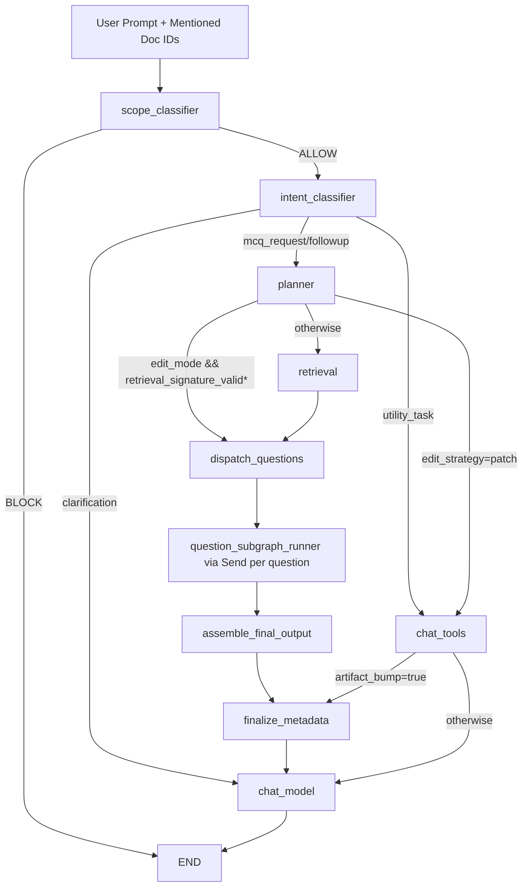
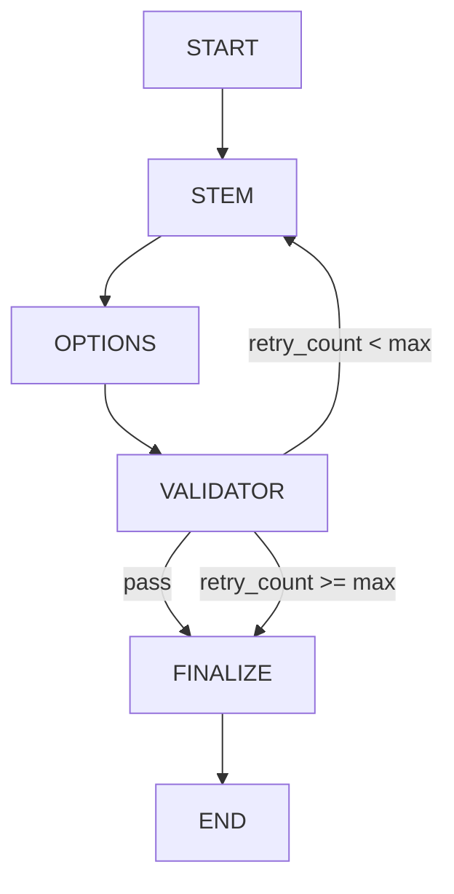

# Chat Agent Flow (Current)

This document describes the active chat graph implemented in `src/agents/chat_agent.py` and its per-question MCQ subgraph in `src/agents/mcq_subgraph.py`.

## High-Level Flow

\* `retrieval_signature_valid` is currently a placeholder gate.

## Per-Question Subgraph

Each question runs in an isolated subgraph instance. This prevents shared-state collisions and allows independent retry behavior per question.

Properties:

- Fan-out happens per question (`Send` payload includes `plan`, `question_index`, `retrieved_chunks`).
- Subgraph retry loop is local to that question only.
- Main graph receives only finalized draft outputs.

## Main State Contract

Primary fields (from `src/agents/utils/state.py`):

- Guardrails and routing:
  - `before_agent_guardrail`
  - `intent`
- Retrieval and planning:
  - `plan`
  - `plan_version`
  - `retrieved_chunks`
  - `retrieval_status`
  - `validation_feedback`
- Parallel draft aggregation:
  - `mcq_drafts: Annotated[list[MCQDraft], add]`
  - `final_mcqs: list[FinalMCQ]`
- Surgical edit controls:
  - `edit_mode: bool`
  - `edit_target: Literal["all", "specific"]`
  - `edit_indices: list[int]`
  - `edit_strategy: Literal["regenerate", "patch"]`
  - `existing_drafts: list[MCQDraft]`
- Artifact metadata:
  - `artifact_version`
  - `artifact_bump`
  - `tool_result`
  - `retrieval_signature`
  - `retrieval_signature_valid`

## Subgraph State Contract

`QuestionSubgraphState` includes:

- `plan`
- `question_index`
- `retrieved_chunks`
- `existing_draft`
- `stem`
- `options`
- `correct_answer`
- `explanation`
- `retry_count`
- `validation_passed`
- `validation_feedback`
- `draft`

## MCQ Output Contract

- Intermediate: `MCQDraft`
  - `question_index`
  - `stem`
  - `options`
  - `answer`
  - `explanation`
- Final: `FinalMCQ`
  - `question_index`
  - `question`
  - `options[{A|B|C|D, text}]`
  - `right_answer`
  - `explanation`

Explanations are required in final MCQ output. Validator does **not** score explanation quality.

## Ordering and Merge Semantics

- Parallel subgraph outputs are merged using reducer semantics on `mcq_drafts`.
- `assemble_final_output` sorts drafts by `question_index` before emitting `final_mcqs`.

## Placeholder / Deferred Items

The following are intentionally scaffolded but not fully implemented yet:

1. `chat_tools` execution is a placeholder route.
2. `patch_mcq` tool behavior is scaffolded; no full patch engine yet.
3. Retrieval-skip validity logic (`retrieval_signature_valid`) is placeholder-driven.
4. Artifact version persistence is state-level; no dedicated DB versioning contract yet.
5. Session summary lifecycle is currently represented as prompt inputs/placeholders.

## Model Placeholders

All new modular nodes default to `gpt-4.1-nano` placeholders in `src/agents/utils/llm_config.py`:

- `guardrail_llm`
- `intent_llm`
- `planner_llm`
- `retrieval_llm`
- `stem_llm`
- `options_llm`
- `validator_llm`
- `chat_no_tools_llm`

These aliases are intended to be swapped without changing graph logic.

## Prompt Layout

Prompt modules are split by concern in `src/agents/prompts`:

- `classification.py`
- `planner.py`
- `generation.py`
- `validator.py`
- `chat.py`

Registry entrypoint: `src/agents/prompts/__init__.py`.

## Context Engineering Notes

- `stem_generator` gets compact plan context + retrieved chunks.
- `options_generator` gets compact plan context + stem + `distractor_strategy` (no full retrieved chunk dump).
- `validator` gets compact plan context + draft + retrieved chunks for factual-grounding checks.
- Plan payloads intentionally exclude retrieval-only fields like `retrieval_queries` to reduce token overhead.

## Observability

Nodes emit custom stream updates through `get_stream_writer()` for progress status and details, enabling SSE event replay at the API layer.
