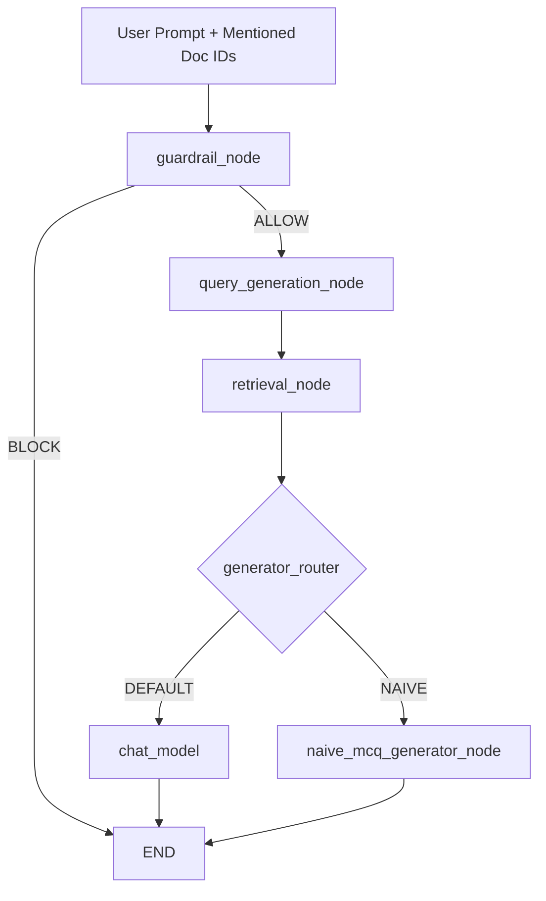
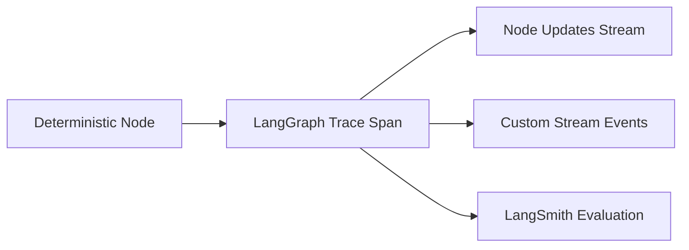

# Chat Agent Flow

This document defines the active chat invocation flow and state transitions.

## Execution Order

## State Contract

The active chat state carries the following retrieval-related fields:

- `user_prompt: str`
- `doc_ids: list[uuid.UUID]`
- `user_id: str`
- `search_queries: list[str]`
- `retrieved_chunks: list[RetrievedChunk]`
- `use_naive_generator: bool`

`RetrievedChunk` shape:

- `chunk_id: str`
- `doc_id: str`
- `content: str`
- `score: float`
- `metadata: dict`

## Query Generation Node

`query_generation_node` performs a deterministic prompt-chained step:

1. Reads `user_prompt` and `doc_ids` from graph state.
2. Fetches concept map from `document_concepts` for mentioned documents.
3. Generates `num_search_queries` semantic queries.
4. Writes `search_queries` to graph state.

## Retrieval Node

`retrieval_node` performs deterministic retrieval:

1. Iterates over `search_queries`.
2. Executes vector search with strict filter `document_id IN doc_ids`.
3. Merges results and deduplicates by `chunk_id` or content hash.
4. Caps output to `max_retrieved_chunks`.
5. Writes `retrieved_chunks` to graph state.

## Generator Handoff

The default generator (`chat_model`) receives grounded context from `retrieved_chunks` by prepending a system grounding message. The naive generator branch is enabled only when `use_naive_mcq_generator` is true.

## Observability Pattern

The retrieval step is implemented as a deterministic graph node (Runnable-backed function node), not a ToolNode.

This pattern keeps routing deterministic and provides clear per-node traces for evaluation.
