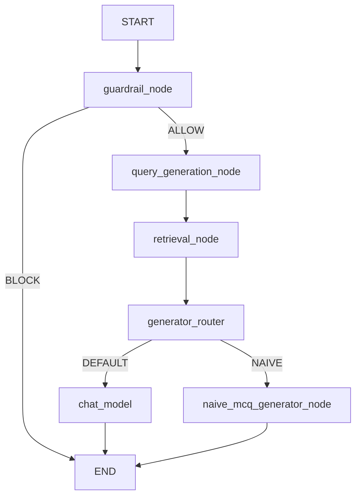
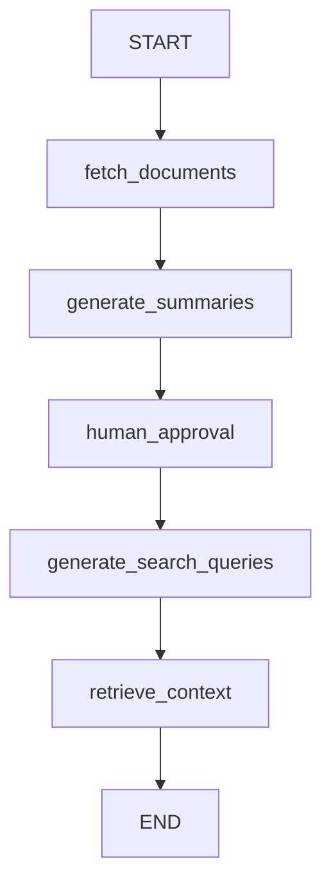

# Agents

This directory contains LangGraph-based agent workflows used by Otis.

## Active Chat Graph

File: `src/agents/chat_agent.py`

### Purpose

- `guardrail_node`: intent/safety gate.
- `query_generation_node`: builds semantic search queries from user prompt + concept map.
- `retrieval_node`: strict doc-scoped vector retrieval with dedupe and cap.
- `chat_model`: default generation path, grounded by retrieved chunks.
- `naive_mcq_generator_node`: feature-flag path for fast MCQ iteration.

## Legacy Generation Graph

File: `src/agents/graph.py`

This graph is still used by `/v1/graph/start` and `/v1/graph/resume` SSE endpoints.

## Runtime Configuration

Configured via `src/core/config.py`:

- `num_search_queries` (default `5`)
- `max_retrieved_chunks` (default `20`)
- `use_naive_mcq_generator` (default `False`)
- `chat_graph_retrieval_enabled` (default `True`)
- `chat_router_retrieval_fallback` (default `False`)
