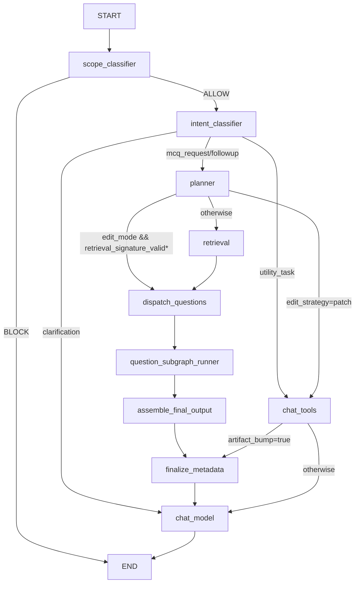
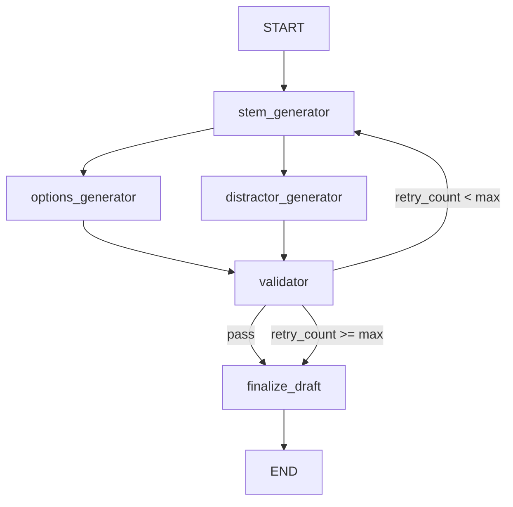
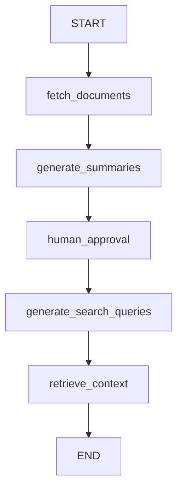

# Agents

This directory contains LangGraph-based agent workflows used by Otis.

## Active Chat Graph

File: `src/agents/chat_agent.py`

### Purpose

- `scope_classifier`: binary scope/safety gate (ALLOW/BLOCK).
- `intent_classifier`: routes request to MCQ planning, tools, or clarification reply.
- `planner`: produces MCQ plan and edit-mode controls.
- `retrieval`: retrieves chunks from doc-scoped context.
- `dispatch_questions`: fans out per question via Send API.
- `question_subgraph_runner`: runs isolated per-question generation+validation subgraph.
- `assemble_final_output`: sorts by `question_index` and builds final MCQ output.
- `finalize_metadata`: bumps `artifact_version` when required.
- `chat_tools`: placeholder branch for utility tools / patch strategy.
- `chat_model`: final response synthesis node.

\* `retrieval_signature_valid` is a placeholder gate for skip-retrieval behavior.

### Per-Question Subgraph

File: `src/agents/mcq_subgraph.py`

Subgraph state is isolated per question. Retries do not affect other question instances.

## Legacy Generation Graph

File: `src/agents/graph.py`

This graph is still used by `/v1/graph/start` and `/v1/graph/resume` SSE endpoints.

## Runtime Configuration

Configured via `src/core/config.py`:

- `num_search_queries` (default `5`)
- `max_retrieved_chunks` (default `20`)
- `use_naive_mcq_generator` (default `False`)
- `chat_graph_retrieval_enabled` (default `True`)
- `chat_router_retrieval_fallback` (default `False`)

## Placeholder Notes

- `patch_mcq` tool behavior is scaffolded but not fully implemented.
- Retrieval validity signature (`retrieval_signature` / `retrieval_signature_valid`) is scaffolded.
- Artifact versioning is state-level placeholder (no dedicated DB persistence contract yet).
