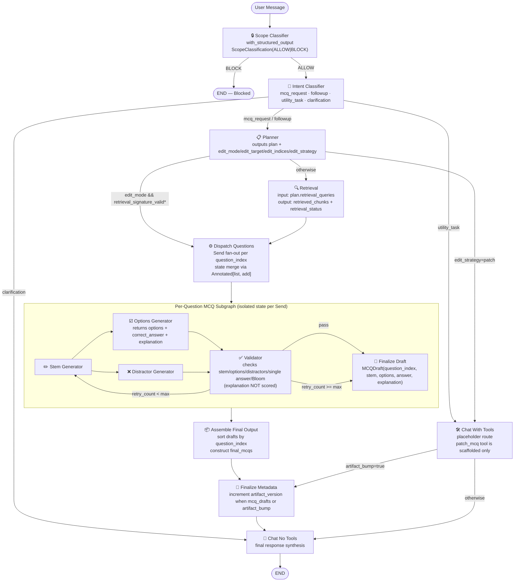

# Chat Graph Flow (Implemented)

```mermaid
flowchart TD
        START([User Message]) --> SC

        SC["🔒 Scope Classifier\nwith_structured_output\nScopeClassification(ALLOW|BLOCK)"]
        SC -->|BLOCK| BLOCKED_END([END — Blocked])
        SC -->|ALLOW| IC

        IC["🧭 Intent Classifier\nmcq_request · followup · utility_task · clarification"]
        IC -->|mcq_request / followup| PLANNER
        IC -->|utility_task| CHAT_TOOLS
        IC -->|clarification| CHAT_NO_TOOLS

        PLANNER["📋 Planner\noutputs plan + edit_mode/edit_target/edit_indices/edit_strategy"]
        PLANNER -->|edit_strategy=patch| CHAT_TOOLS
        PLANNER -->|edit_mode && retrieval_signature_valid*| DISPATCH
        PLANNER -->|otherwise| RETRIEVAL

        RETRIEVAL["🔍 Retrieval\ninput: plan.retrieval_queries\noutput: retrieved_chunks + retrieval_status"]
        RETRIEVAL --> DISPATCH

        DISPATCH["⚙️ Dispatch Questions\nSend fan-out per question_index\nstate merge via Annotated[list, add]"]
        DISPATCH --> SUBGRAPH

        subgraph SUBGRAPH["Per-Question MCQ Subgraph (isolated state per Send)"]
            STEM["✏️ Stem Generator"]
            OPTIONS["☑️ Options Generator\nreturns options + correct_answer + explanation"]
            DISTRACTORS["❌ Distractor Generator"]
            VALIDATOR["✅ Validator\nchecks stem/options/distractors/single answer/Bloom\n(explanation NOT scored)"]
            FINALIZE_DRAFT["📄 Finalize Draft\nMCQDraft(question_index, stem, options, answer, explanation)"]

            STEM --> OPTIONS
            STEM --> DISTRACTORS
            OPTIONS --> VALIDATOR
            DISTRACTORS --> VALIDATOR
            VALIDATOR -->|pass| FINALIZE_DRAFT
            VALIDATOR -->|retry_count < max| STEM
            VALIDATOR -->|retry_count >= max| FINALIZE_DRAFT
        end

        SUBGRAPH --> ASSEMBLE
        ASSEMBLE["📦 Assemble Final Output\nsort drafts by question_index\nconstruct final_mcqs"] --> METADATA
        METADATA["🧾 Finalize Metadata\nincrement artifact_version when mcq_drafts or artifact_bump"] --> CHAT_NO_TOOLS

        CHAT_TOOLS["🛠️ Chat With Tools\nplaceholder route\npatch_mcq tool is scaffolded only"] -->|artifact_bump=true| METADATA
        CHAT_TOOLS -->|otherwise| CHAT_NO_TOOLS

        CHAT_NO_TOOLS["💬 Chat No Tools\nfinal response synthesis"] --> END_NODE([END])
```

\* `retrieval_signature_valid` is currently a placeholder gate and not fully computed.
